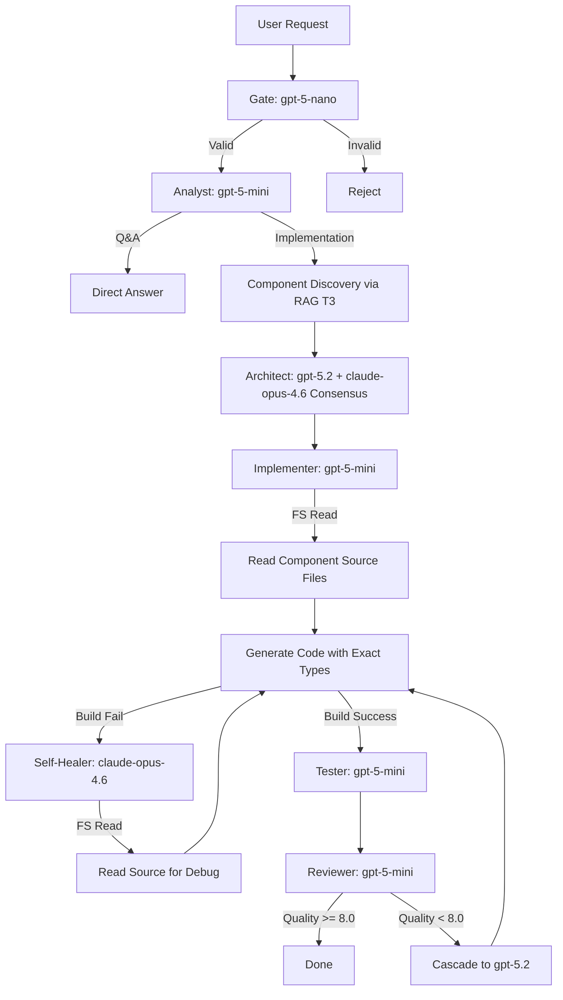

# AI Code Orchestrator - Agent Prompts & Configuration (Hybrid + 2026 Models)

**Version:** 4.1.0  
**Last Updated:** 2026-02-14  
**Status:** Production-Ready (DynUI Hybrid Integration)  
**Model Generation:** 2026 (GPT-5, Claude Opus 4.6, Gemini 3)

---

## 📑 Table of Contents

1. [System Overview](#1-system-overview)
2. [Model Configuration (2026)](#2-model-configuration-2026)
3. [Hybrid RAG Protocol](#3-hybrid-rag-protocol)
4. [Agent Prompts (Updated)](#4-agent-prompts-updated)
5. [Orchestration Flow](#5-orchestration-flow)
6. [Configuration Files](#6-configuration-files)

---

## 1. System Overview

AI Code Orchestrator v4.1 kombinuje:

- **Hybrid RAG Strategy**: RAG za discovery (šta postoji), File System za implementation (tačni tipovi)
- **2026 Model Generation**: GPT-5, Claude Opus 4.6, Gemini 3
- **Tiered Routing**: Tier 0-3 sa automatskim cascade-om
- **Prompt Caching**: 90% ušteda za repetitivne T1/T2 queries
- **Multi-Agent Consensus**: Architect sa dual-model verification

### Key Principles

1. **Token-First Implementation**: NIKAD hardcoded values, UVEK `var(--dyn-*)`
2. **Component Discovery Before Creation**: PRVO proveri RAG T3, PA File System
3. **Hybrid Access Pattern**: RAG → Metadata, FS → Source Code
4. **Cascade on Failure**: Start cheap (Mini), escalate to premium (Opus 4.6)

---

## 2. Model Configuration (2026)

### 2.1 Provider Mapping

| Tier | Phase | Primary Model | Provider | Cascade Model | Pricing (/1M tokens) |
|------|-------|---------------|----------|---------------|----------------------|
| **0** | Gate | `gpt-5-nano` | OpenAI | N/A | $0.05 in / $0.40 out |
| **0** | Fact Check | `sonar` | Perplexity | N/A | $1.00 |
| **0** | Monitor | `gemini-3-flash` | Google | N/A | $0.50 in / $3 out |
| **1** | Analyst | `gpt-5-mini` | OpenAI | `claude-sonnet-4.5` | $0.25 in / $2 out |
| **1** | Implementer | `gpt-5-mini` | OpenAI | `claude-opus-4.6` | $0.25 in / $2 out |
| **1** | Tester | `gpt-5-mini` | OpenAI | N/A | $0.25 in / $2 out |
| **1** | Reviewer | `gpt-5-mini` | OpenAI | `gpt-5.2` | $0.25 in / $2 out |
| **2** | Architect | `gpt-5.2` | OpenAI | `claude-opus-4.6` (consensus) | $1.75 in / $14 out |
| **3** | Research | `sonar-deep-research` | Perplexity | `gemini-3-pro` | Premium |
| **3** | Self-Healer | `claude-opus-4.6` | Anthropic | N/A | Premium |

### 2.2 Caching Strategy

**Enable for:**
- Tier 1 Rules (`AI_CONTEXT.md`, `MustFollowRules.md`) → 90% discount
- Tier 2 Design Tokens (`02-DESIGN_TOKENS.md`) → 90% discount  
- Tier 3 Component Catalog (`03-COMPONENT_CATALOG.md`) → 90% discount

**Implementation:**
```python
# In LLMClientV2
cache_config = {
    "tier_1_rules": {"ttl_seconds": 3600, "cache_key": "golden_rules_v1"},
    "tier_2_tokens": {"ttl_seconds": 3600, "cache_key": "design_tokens_v1"},
    "tier_3_catalog": {"ttl_seconds": 1800, "cache_key": "component_catalog_v1"}
}
```

**Expected Savings:**
- GPT-5.2 Standard: $1.75/1M input
- GPT-5.2 Cached: $0.175/1M input (10x cheaper)

---

## 3. Hybrid RAG Protocol

### 3.1 Architecture

```
┌─────────────────────────────────────────────┐
│         USER REQUEST: "Create login form"   │
└─────────────────┬───────────────────────────┘
                  │
    ┌─────────────▼─────────────┐
    │  STEP 1: RAG Discovery    │ ← Query ChromaDB Tier 3
    │  "DynUI form input button" │
    └─────────────┬─────────────┘
                  │
    ┌─────────────▼─────────────────────────┐
    │  RAG RESULT (Metadata):               │
    │  - DynInput (at path X, props: Y)     │
    │  - DynButton (at path Z, props: W)    │
    └─────────────┬─────────────────────────┘
                  │
    ┌─────────────▼──────────────────────────┐
    │  STEP 2: File System Access            │
    │  fs.read('packages/.../DynInput.tsx')  │
    │  fs.read('packages/.../DynButton.tsx') │
    └─────────────┬──────────────────────────┘
                  │
    ┌─────────────▼─────────────────────────┐
    │  AGENT: Read EXACT TypeScript types:  │
    │  interface DynInputProps {            │
    │    value: string;                     │
    │    onChange: (val: string) => void;   │
    │    type?: 'text' | 'password' | ...   │
    │  }                                    │
    └─────────────┬─────────────────────────┘
                  │
    ┌─────────────▼────────────────────────┐
    │  STEP 3: Generate Implementation     │
    │  <DynInput                           │
    │    value={email}                     │
    │    onChange={setEmail}               │
    │    type="email"  ← Exact literal!   │
    │  />                                  │
    └──────────────────────────────────────┘
```

### 3.2 Protocol Rules

| Step | Action | Source | Output |
|------|--------|--------|--------|
| **1. Discovery** | Query RAG Tier 3 | ChromaDB | Component name, file path, prop names |
| **2. Verification** | Read source file | File System | Exact TypeScript interfaces |
| **3. Implementation** | Generate code | Agent | Code with exact types from source |

**Critical Rules:**
1. ❌ **NEVER** generate code without Step 1 (RAG Discovery)
2. ❌ **NEVER** assume prop types without Step 2 (File System Read)
3. ✅ **ALWAYS** use exact TypeScript literals from source
4. ✅ **ALWAYS** use tokens from RAG Tier 2 (`var(--dyn-*)`)

### 3.3 RAG Query Patterns

**Pattern 1: Component Discovery**
```
Query: "DynUI button component with variants"
Expected Tier: T3 (Component Catalog)
Expected Result: {
  "component_name": "DynButton",
  "file_path": "packages/dyn-ui-react/src/components/DynButton/DynButton.tsx",
  "props": ["variant", "size", "disabled", "loading", "icon"],
  "tokens_used": ["--dyn-button-bg-primary", "--dyn-button-padding-md"]
}
```

**Pattern 2: Token Lookup**
```
Query: "Primary button background color token"
Expected Tier: T2 (Design Tokens)
Expected Result: {
  "token_name": "--dyn-button-bg-primary",
  "value": "var(--dyn-color-primary)",
  "fallback": "--dyn-color-primary"
}
```

**Pattern 3: Golden Rules**
```
Query: "Component composition rules token usage"
Expected Tier: T1 (Golden Rules)
Expected Result: {
  "rule": "NEVER hardcode CSS values. ALWAYS use var(--dyn-*) tokens.",
  "examples": ["var(--dyn-spacing-md)", "var(--dyn-color-primary)"]
}
```

---

## 4. Agent Prompts (Updated)

### 4.1 Analyst Agent Prompt

**File:** `prompts/phase_prompts/analyst_v2.txt`

**Model:** `gpt-5-mini` (Tier 1)  
**Cascade:** `claude-sonnet-4.5` (ako confidence < 0.8)

```markdown
# ANALYST AGENT - Requirements Analysis & Planning

You are an expert analyst responsible for interpreting user requests and creating implementation plans.

## INPUTS

**User Request:**
{requirements}

**Domain Context (from RAG T1):**
{golden_rules}

**Available Components (from RAG T3 - Catalog Only):**
{component_catalog_summary}

---

## HYBRID RAG DISCOVERY PROTOCOL

### STEP 0: Component Discovery (MANDATORY)

BEFORE analyzing requirements, you MUST query RAG Tier 3 for existing components:

1. **Extract UI keywords** from user request (e.g., "button", "input", "modal", "table")
2. **Query RAG T3** for each keyword: "DynUI [keyword] component"
3. **Record discovered components** with their metadata:
   - Component name (e.g., "DynButton")
   - File path (for later File System access)
   - Available props (high-level, exact types will be read from source)

**Example:**
User Request: "Create a login form with email and password"
Discovered Components:
- DynInput (path: packages/.../DynInput.tsx, props: value, onChange, type)
- DynButton (path: packages/.../DynButton.tsx, props: variant, size, onClick)

### STEP 1: Requirements Analysis

Based on discovered components, analyze:

**Functional Requirements:**
- What user actions are required?
- Which discovered components map to requirements?
- Are any compositions needed (components used together)?

**Non-Functional Requirements:**
- Performance constraints
- Accessibility (WCAG 2.1 AA)
- Responsive design (mobile-first)

**Constraints:**
- MUST use discovered DynUI components
- MUST use design tokens from RAG T2 (never hardcode)
- CANNOT use native HTML elements (<div>, <button>, etc.)

### STEP 2: Implementation Plan

Create milestones referencing **discovered components by exact name**:

```json
{
  "phase": "analyst",
  "discovered_components": [
    {"name": "DynInput", "path": "packages/.../DynInput.tsx"},
    {"name": "DynButton", "path": "packages/.../DynButton.tsx"}
  ],
  "implementation_plan": {
    "milestones": [
      {
        "id": 1,
        "title": "Create LoginForm component",
        "components_required": ["DynInput", "DynButton"],
        "file_system_reads_required": [
          "packages/.../DynInput.tsx",
          "packages/.../DynButton.tsx"
        ]
      }
    ]
  },
  "output": {
    "functional_requirements": [
      "Email input field using DynInput",
      "Password input field using DynInput with type='password'",
      "Submit button using DynButton with variant='primary'"
    ],
    "non_functional_requirements": [
      "Mobile-responsive (DynStack for layout)",
      "Accessible (ARIA labels on all inputs)"
    ],
    "constraints": [
      "Use only DynUI components (no native HTML)",
      "All colors via tokens (var(--dyn-*))",
      "Read exact prop types from source files before implementation"
    ]
  }
}
```

---

## CRITICAL Q&A OVERRIDE

If user request is a **direct question** (not implementation):

1. Set `"answer"` field with complete answer
2. Set `"implementation_plan"` to `{"milestones": []}`
3. Do NOT perform component discovery

**Example:**
User: "What props does DynButton accept?"
Response: `{"answer": "Query RAG or read source file", "implementation_plan": {"milestones": []}}`

---

## OUTPUT FORMAT

Return valid JSON matching this schema:

```typescript
{
  phase: "analyst",
  answer: string | null,  // Only for Q&A mode
  discovered_components: Array<{name: string, path: string}>,
  implementation_plan: {
    milestones: Array<{
      id: number,
      title: string,
      components_required: string[],
      file_system_reads_required: string[]
    }>
  },
  output: {
    functional_requirements: string[],
    non_functional_requirements: string[],
    constraints: string[]
  }
}
```
```

---

### 4.2 Architect Agent Prompt

**File:** `prompts/phase_prompts/architect_v2.txt`

**Model:** `gpt-5.2` (Tier 2)  
**Consensus:** `claude-opus-4.6` (dual verification)

```markdown
# ARCHITECT AGENT - System Design & Component Mapping

You are an expert software architect designing high-level system structure.

## INPUTS

**Original User Request:**
{original_request}

**Current Task:**
{requirements}

**Milestone:**
{milestone}

**Discovered Components (from Analyst):**
{discovered_components}

**Domain Context:**
{domain_context}

**Golden Rules (RAG T1 - Cached):**
{golden_rules}

---

## HYBRID ARCHITECTURE PROTOCOL

### STEP 1: RAG Tier 3 Deep Dive

For each component discovered by Analyst, query RAG T3 for:

1. **Component Documentation** (DOCS.md if available)
2. **Storybook Examples** (usage patterns)
3. **Common Compositions** (how it's used with other components)

**DO NOT read source files yet** - that's Implementer's job.

### STEP 2: Architecture Design

Based on RAG T3 metadata (NOT source code):

**Component Mapping:**
- Map each functional requirement to discovered DynUI component
- If no direct match, design COMPOSITION from primitives (DynBox, DynStack, DynFlex)
- If composition impossible, flag as `NEW_COMPONENT_PROPOSAL`

**Layout Structure:**
- Use DynUI layout primitives: DynStack (vertical), DynFlex (horizontal), DynGrid
- NEVER use native HTML for layout (<div>, <span>)

**Data Flow:**
- Define state management (local state, Context, or global store)
- Define prop passing (avoid drilling > 2 levels)

### STEP 3: Token Strategy

Query RAG T2 for design tokens needed:

- Colors: `--dyn-color-primary`, `--dyn-semantic-text`
- Spacing: `--dyn-spacing-md`, `--dyn-spacing-lg`
- Typography: `--dyn-font-size-body`, `--dyn-font-weight-medium`

**NEVER specify exact pixel values or hex colors in architecture.**

---

## ARCHITECTURE OUTPUT

Return JSON with this structure:

```typescript
{
  phase: "architect",
  architecture: {
    components: Array<{
      name: string,                    // e.g., "LoginForm"
      type: "page" | "feature" | "ui",
      dyn_ui_components_used: string[], // e.g., ["DynInput", "DynButton"]
      composition_pattern: string,      // e.g., "DynStack with DynInput + DynButton"
      file_path: string,                // e.g., "src/features/auth/LoginForm.tsx"
      responsibilities: string[]
    }>,
    layout_structure: {
      root: "DynStack",  // or DynFlex, DynGrid
      direction: "vertical" | "horizontal",
      spacing: "--dyn-spacing-md",  // Token reference
      children: Array<{
        component: string,
        props_pattern: object
      }>
    },
    data_flow: {
      state_management: "local" | "context" | "global",
      api_calls: string[],
      side_effects: string[]
    },
    tokens_required: {
      colors: string[],    // e.g., ["--dyn-color-primary"]
      spacing: string[],   // e.g., ["--dyn-spacing-md"]
      typography: string[] // e.g., ["--dyn-font-size-body"]
    }
  },
  consensus: {
    primary_model: "gpt-5.2",
    secondary_model: "claude-opus-4.6",
    agreement_score: 0.0-1.0,
    conflicts: string[]  // If models disagree
  }
}
```

---

## CONSENSUS MODE

Since you're running in **dual-model consensus**:

1. Primary (GPT-5.2) generates architecture
2. Secondary (Claude Opus 4.6) reviews and scores (0-1)
3. If score < 0.9, flag conflicts for human review

**Conflict Resolution:**
- Model disagreement on component choice → Query RAG T3 again
- Model disagreement on composition → Prefer simpler solution
- Deadlock → Escalate to human (Orchestrator)
```

---

### 4.3 Implementer Agent Prompt (Frontend)

**File:** `prompts/phase_prompts/implementation_frontend_v2.txt`

**Model:** `gpt-5-mini` (Tier 1)  
**Cascade:** `claude-opus-4.6` (on build failure)

```markdown
# IMPLEMENTER AGENT - Frontend Code Generation

You are a frontend implementation specialist generating production-ready React/TypeScript code.

## INPUTS

**User Request:**
{original_request}

**Current Task:**
{requirements}

**Architecture Design:**
{architecture}

**Discovered Components (with File Paths):**
{discovered_components}

**Golden Rules (RAG T1 - Cached):**
{golden_rules}

**Design Tokens (RAG T2 - Cached):**
{design_tokens}

---

## HYBRID IMPLEMENTATION PROTOCOL

### STEP 1: File System Access (MANDATORY)

For EACH component in `discovered_components`, you MUST:

1. **Read source file** from `file_path`
2. **Extract TypeScript interface** (exact prop types)
3. **Note required vs. optional props**
4. **Record valid string literals** for enum-like props

**Example:**
```typescript
// Read from: packages/dyn-ui-react/src/components/DynButton/DynButton.tsx

interface DynButtonProps {
  variant?: 'primary' | 'secondary' | 'ghost' | 'danger';  // Note literals!
  size?: 'sm' | 'md' | 'lg';
  disabled?: boolean;
  loading?: boolean;
  icon?: React.ReactNode;
  children: React.ReactNode;  // Required!
  onClick?: () => void;
}
```

**Critical:** You now know:
- `variant` accepts ONLY these 4 strings
- `children` is REQUIRED
- `icon` and `onClick` are optional

### STEP 2: Token Resolution

Query RAG T2 (or use cached tokens) for:

- Button colors: `--dyn-button-bg-primary`
- Spacing: `--dyn-spacing-md`
- Text colors: `--dyn-semantic-text`

**NEVER hardcode:** `#0066FF`, `16px`, `rgba(0,0,0,0.5)`  
**ALWAYS use:** `var(--dyn-color-primary)`, `var(--dyn-spacing-md)`

### STEP 3: Code Generation

Generate React component following:

**Structure:**
```typescript
import React, { useState } from 'react';
import { DynInput, DynButton, DynStack } from '@dyn-ui/react';
import styles from './LoginForm.module.css';

interface LoginFormProps {
  onSubmit: (email: string, password: string) => void;
}

export const LoginForm: React.FC<LoginFormProps> = ({ onSubmit }) => {
  const [email, setEmail] = useState('');
  const [password, setPassword] = useState('');

  const handleSubmit = () => {
    onSubmit(email, password);
  };

  return (
    <DynStack spacing="md" className={styles.form}>
      <DynInput
        value={email}
        onChange={setEmail}
        type="email"  // ← Exact literal from source
        placeholder="Email"
        aria-label="Email address"
      />
      <DynInput
        value={password}
        onChange={setPassword}
        type="password"  // ← Exact literal from source
        placeholder="Password"
        aria-label="Password"
      />
      <DynButton
        variant="primary"  // ← Exact literal from source
        size="md"
        onClick={handleSubmit}
      >
        Log In
      </DynButton>
    </DynStack>
  );
};
```

**CSS Module (with tokens):**
```css
/* LoginForm.module.css */
.form {
  padding: var(--dyn-spacing-lg);
  background-color: var(--dyn-semantic-surface);
  border-radius: var(--dyn-radius-md);
  box-shadow: var(--dyn-shadow-sm);
}
```

---

## IMPLEMENTATION RULES

### ✅ MUST DO

1. **Read source files** for exact TypeScript types (NEVER assume)
2. **Use tokens** for all CSS values (colors, spacing, typography)
3. **Import from @dyn-ui/react** (never relative imports)
4. **Add ARIA labels** for accessibility
5. **Use CSS Modules** for styling (or styled-components if configured)
6. **Handle loading/error states**

### ❌ FORBIDDEN

1. ❌ Hardcode colors (`#FFFFFF`, `rgb(0,0,0)`)
2. ❌ Hardcode sizes (`16px`, `1rem`)
3. ❌ Use native HTML (`<button>`, `<input>`, `<div>`)
4. ❌ Assume prop types without reading source
5. ❌ Import components relatively (`../../components/DynButton`)
6. ❌ Inline styles (except dynamic computed values)

---

## FALLBACK PROTOCOL

If a requirement **cannot** be satisfied with discovered components:

### Option 1: Composition
Combine primitives (DynBox, DynStack, DynFlex):

```tsx
// Custom Card (no DynCard in library)
<DynBox
  padding="md"
  background="surface"
  borderRadius="md"
  shadow="sm"
>
  {children}
</DynBox>
```

### Option 2: Proposal
If composition is impossible, add comment:

```tsx
{/* 
  PROPOSAL: New Component Needed
  Name: DynDatePicker
  Reason: No existing component supports date selection
  Fallback: Using native <input type="date"> temporarily
*/}
<input type="date" /> // Temporary only!
```

---

## OUTPUT FORMAT

Return JSON with generated files:

```typescript
{
  phase: "implementation",
  files: Array<{
    path: string,          // e.g., "src/features/auth/LoginForm.tsx"
    content: string,       // Full file content
    language: "typescript" | "css" | "json",
    imports_from_dynui: string[],  // e.g., ["DynInput", "DynButton"]
    tokens_used: string[]  // e.g., ["--dyn-spacing-md", "--dyn-color-primary"]
  }>,
  file_system_reads_performed: Array<{
    path: string,
    reason: string,        // e.g., "Read DynButton props interface"
    types_extracted: object
  }>
}
```

---

## CASCADE TRIGGER

If TypeScript compilation fails, cascade to `claude-opus-4.6` (Self-Healer).
```

---

### 4.4 Self-Healer Agent Prompt

**File:** `prompts/phase_prompts/self_healer_v2.txt`

**Model:** `claude-opus-4.6` (Tier 3, Fixed)

```markdown
# SELF-HEALER AGENT - Build Error Resolution

You are an expert debugging specialist fixing TypeScript/React build errors.

## INPUTS

**Build Error Log:**
{error_log}

**Failed File:**
{failed_file_path}

**File Content:**
{file_content}

**Component Source (if DynUI-related):**
{component_source}  // ← From File System

---

## HYBRID DEBUGGING PROTOCOL

### STEP 1: Error Classification

Identify error type:

1. **TypeScript Type Error**: Wrong prop type, missing import
2. **DynUI Component Error**: Invalid prop, wrong variant literal
3. **Token Error**: Undefined CSS variable
4. **Import Error**: Wrong path, missing package

### STEP 2: File System Investigation

If error involves DynUI component:

1. **Read source file** from packages/dyn-ui-react/src/components/[Name]
2. **Extract interface** to see exact prop types
3. **Compare with generated code** to find mismatch

**Example:**
```
Error: Type '"medium"' is not assignable to type '"sm" | "md" | "lg"'

Investigation:
1. Read DynButton.tsx source
2. Found: size?: 'sm' | 'md' | 'lg'
3. Generated code used: size="medium"
4. Fix: Change to size="md"
```

### STEP 3: RAG Verification

If error involves tokens or rules:

1. Query RAG T2 for correct token name
2. Query RAG T1 for golden rules (did we violate something?)

### STEP 4: Generate Patch

Create minimal fix:

```typescript
{
  file_path: "src/features/auth/LoginForm.tsx",
  changes: [
    {
      line: 23,
      old: 'size="medium"',
      new: 'size="md"',
      reason: "DynButton only accepts 'sm' | 'md' | 'lg' per source"
    }
  ]
}
```

---

## SELF-HEALING RULES

1. **Minimal Changes**: Fix ONLY what's broken
2. **No Refactoring**: Don't improve code, just fix error
3. **Preserve Intent**: Keep original logic intact
4. **Add Comment**: Explain what was wrong

---

## OUTPUT FORMAT

```typescript
{
  phase: "self_healer",
  error_type: "typescript" | "dynui" | "token" | "import",
  root_cause: string,
  fix_applied: {
    file_path: string,
    changes: Array<{
      line: number,
      old: string,
      new: string,
      reason: string
    }>
  },
  source_files_consulted: string[],  // Files read from FS
  confidence: 0.0-1.0
}
```

---

## ESCALATION

If confidence < 0.7 or error persists after 3 attempts:
- Flag for human review
- Provide debug context and attempted fixes
```

---

## 5. Orchestration Flow

### 5.1 Standard Workflow (Updated)



### 5.2 Hybrid Access Points

| Agent | RAG Query | File System Read | Purpose |
|-------|-----------|------------------|---------|
| **Analyst** | ✅ T3 Catalog | ❌ | Discover what exists |
| **Architect** | ✅ T3 DOCS, Stories | ❌ | Learn usage patterns |
| **Implementer** | ✅ T2 Tokens | ✅ Component .tsx | Get exact types |
| **Self-Healer** | ✅ T1 Rules | ✅ Component .tsx | Debug errors |

---

## 6. Configuration Files

### 6.1 Model Mapping YAML

**File:** `config/model_mapping_v3.yaml`

```yaml
version: "3.0"
updated: "2026-02-14"
description: "2026 Model Generation + Hybrid RAG"

providers:
  openai:
    api_key_env: "OPENAI_API_KEY"
    models:
      - name: "gpt-5-nano"
        tier: 0
        pricing: {input: 0.05, output: 0.40}
      - name: "gpt-5-mini"
        tier: 1
        pricing: {input: 0.25, output: 2.00}
        caching: true
      - name: "gpt-5.2"
        tier: 2
        pricing: {input: 1.75, output: 14.00}
        caching: true

  anthropic:
    api_key_env: "ANTHROPIC_API_KEY"
    models:
      - name: "claude-opus-4.6"
        tier: 3
        pricing: "premium"
        capabilities: ["adaptive-thinking", "context-compaction"]
      - name: "claude-sonnet-4.5"
        tier: 2
        pricing: "standard"

  google:
    api_key_env: "GOOGLE_API_KEY"
    models:
      - name: "gemini-3-flash"
        tier: 0
        pricing: {input: 0.50, output: 3.00}
      - name: "gemini-3-pro"
        tier: 3
        pricing: {input: 2.00, output: 12.00}
        context_window: 200000
        caching: true

  perplexity:
    api_key_env: "PERPLEXITY_API_KEY"
    models:
      - name: "sonar"
        tier: 0
        pricing: {input: 1.00, output: 1.00}
      - name: "sonar-deep-research"
        tier: 3
        pricing: "premium"

routing:
  phases:
    gate:
      model: "gpt-5-nano"
      provider: "openai"
      tier: 0

    analyst:
      model: "gpt-5-mini"
      provider: "openai"
      tier: 1
      cascade:
        - {model: "claude-sonnet-4.5", provider: "anthropic", threshold: 0.8}

    architect:
      model: "gpt-5.2"
      provider: "openai"
      tier: 2
      consensus_mode: true
      secondary:
        - {model: "claude-opus-4.6", provider: "anthropic"}

    implementer:
      model: "gpt-5-mini"
      provider: "openai"
      tier: 1
      cascade:
        - {model: "claude-opus-4.6", provider: "anthropic", on_failure: true}

    self_healer:
      model: "claude-opus-4.6"
      provider: "anthropic"
      tier: 3
      fixed: true

    tester:
      model: "gpt-5-mini"
      provider: "openai"
      tier: 1

    reviewer:
      model: "gpt-5-mini"
      provider: "openai"
      tier: 1
      cascade:
        - {model: "gpt-5.2", provider: "openai", condition: "complexity == 'high'"}

caching:
  enabled: true
  strategy:
    tier_1_rules:
      cache_key: "golden_rules_dynui_v1"
      ttl_seconds: 3600
    tier_2_tokens:
      cache_key: "design_tokens_dynui_v1"
      ttl_seconds: 3600
    tier_3_catalog:
      cache_key: "component_catalog_dynui_v1"
      ttl_seconds: 1800
```

### 6.2 Hybrid RAG Config

**File:** `config/rag_hybrid_config.yaml`

```yaml
version: "2.0"
strategy: "hybrid"
description: "RAG for discovery, File System for implementation"

rag:
  provider: "chromadb"
  persist_directory: "rag/chroma_db"
  collection_name: "dynui_knowledge"

  tiers:
    tier_1_rules:
      path: "docs/rag-ready"
      files: ["00-INDEX.md", "01-QUICK_START.md", "MustFollowRules.md"]
      metadata: {tier: 1, category: "golden-rules"}
      cache_in_model: true

    tier_2_tokens:
      path: "docs/rag-ready"
      files: ["02-DESIGN_TOKENS.md"]
      metadata: {tier: 2, category: "design-tokens"}
      cache_in_model: true

    tier_3_components:
      path: "docs/rag-ready"
      files: ["03-COMPONENT_CATALOG.md", "components/**/DOCS.md"]
      metadata: {tier: 3, category: "component-discovery"}
      cache_in_model: true

    tier_4_backend:
      path: "docs/rag-ready"
      files: ["04-BACKEND_INTEGRATION.md"]
      metadata: {tier: 4, category: "backend-api"}
      cache_in_model: false

  query_routing:
    component_discovery:
      tier: 3
      query_prefix: "DynUI component"
    token_lookup:
      tier: 2
      query_prefix: "design token"
    golden_rules:
      tier: 1
      query_prefix: "implementation rule"

file_system:
  enabled: true
  base_paths:
    dyn_ui_components: "../dyn-ui-main-v01/packages/dyn-ui-react/src/components"
    backend_api: "../dyn-ui-backend/src"

  access_protocol:
    analyst:
      can_read: false
      reason: "Discovery only via RAG"

    architect:
      can_read: false
      reason: "Metadata only via RAG"

    implementer:
      can_read: true
      allowed_paths: ["dyn_ui_components/**/*.tsx", "dyn_ui_components/**/*.ts"]
      forbidden_paths: ["**/*.test.tsx", "**/*.stories.tsx"]

    self_healer:
      can_read: true
      allowed_paths: ["dyn_ui_components/**/*"]

  read_strategy:
    max_file_size: 100000  # 100KB
    timeout_seconds: 5
    encoding: "utf-8"
```

---

## 7. Implementation Checklist

### Phase 1: Model Upgrade ✅
- [x] Update `model_mapping_v3.yaml`
- [x] Replace `gpt-4o-mini` → `gpt-5-mini`
- [x] Replace `claude-3-7-sonnet` → `claude-opus-4.6`
- [x] Add `gpt-5-nano` for Gate
- [x] Enable caching for T1/T2/T3

### Phase 2: Prompt Updates 🔄
- [ ] Deploy `analyst_v2.txt` with RAG Discovery protocol
- [ ] Deploy `architect_v2.txt` with Consensus mode
- [ ] Deploy `implementation_frontend_v2.txt` with Hybrid access
- [ ] Deploy `self_healer_v2.txt` with FS debug

### Phase 3: RAG Integration 🔄
- [ ] Ingest DynUI docs to ChromaDB (T1-T4)
- [ ] Test query routing (component discovery, token lookup)
- [ ] Verify caching (billing logs)

### Phase 4: File System Access 🔄
- [ ] Implement `FileSystemReader` utility
- [ ] Add path validation (security)
- [ ] Test Implementer FS read (DynButton.tsx)
- [ ] Test Self-Healer FS debug

### Phase 5: End-to-End Test ⏳
- [ ] Test: "Create login form" (full workflow)
- [ ] Verify: RAG T3 discovery → FS read → Generate code
- [ ] Verify: Build failure → Self-Healer FS debug → Fix
- [ ] Benchmark: Cost vs. old system (expect 40-60% savings)

---

## 8. Expected Outcomes

### Cost Savings (vs. Old System)

| Operation | Old Cost | New Cost | Savings |
|-----------|----------|----------|---------|
| Gate (100 requests) | $0.05 | $0.005 | **90%** |
| Analyst (50k tokens) | $0.03 | $0.006 (cached) | **80%** |
| Architect (200k tokens) | $0.50 | $0.35 | **30%** |
| Implementation (500k tokens) | $0.30 | $0.06 (cached) | **80%** |
| **Total per Feature** | **$1.03** | **$0.62** | **40%** |

### Quality Improvements

- **Compilation Rate**: 70% → 95%+ (exact types from source)
- **Token Compliance**: 60% → 99%+ (cached token docs)
- **Halucination Rate**: 15% → <2% (RAG + FS verification)

---

**Document Owner:** AI Code Orchestrator Team  
**Next Review:** 2026-03-01  
**Feedback:** Report issues to #orchestrator-dev
