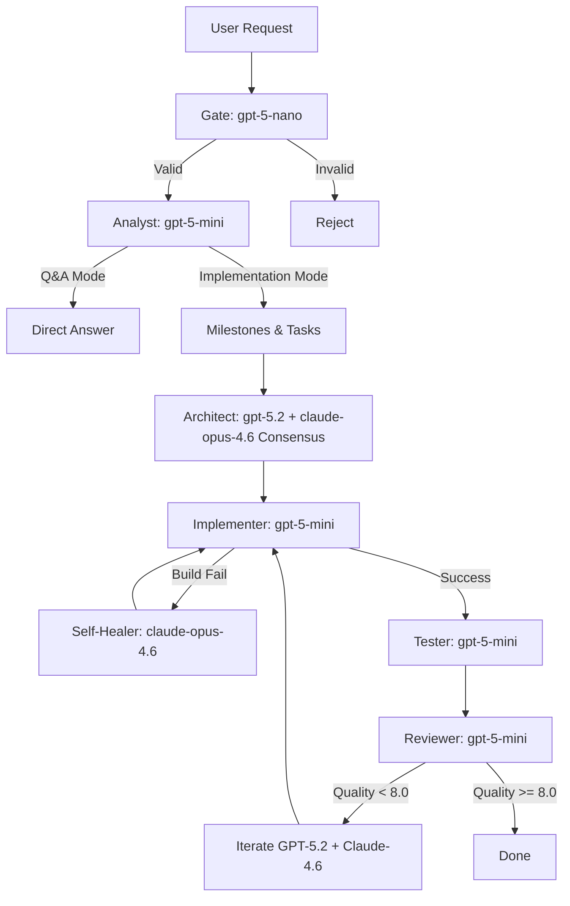

# AI Code Orchestrator - Current Architecture Documentation

**Last Updated**: 2026-02-14  
**Version**: 3.0.0  
**Status**: Pre-DynUI Integration (Baseline)

---

## 1. Pregled Sistema (System Overview)

AI Code Orchestrator je hibridni sistem koji kombinuje:
- **Multi-Agent orkestaciju** (Analyst → Architect → Implementer → Tester)
- **Tiered RAG sistem** (T1: Rules, T2: Tokens, T3: Components, T4: Backend)
- **Cascading model routing** sa automatskim eskalacijama
- **Self-healing verification** sa RepairAgent

---

## 2. Model Mapping & Framework (Ko, Šta, Kada)

### 2.1 Providers & Models

| Provider | Models | Primary Use Case |
|----------|--------|------------------|
| **OpenAI** | `gpt-5.2`, `gpt-5-mini`, `gpt-5-nano` | General coding (agentic), architecture, implementation |
| **Anthropic** | `claude-opus-4.6`, `claude-sonnet-4.5`, `claude-3-5-haiku` | Premium coding, complex logic, self-healing |
| **Google** | `gemini-3-pro`, `gemini-3-flash` | Large context docs, monitoring, log analysis |
| **Perplexity** | `sonar-deep-research`, `sonar-reasoning-pro`, `sonar` | Real-time research, multi-step citation search |

### 2.2 Phase Routing

#### **Tier 0 (Gate & Monitor)**
- **Gate**: `gpt-5-nano` - Jeftina validacija ulaznih prompt-ova ($0.05/1M)
- **Fact Checker**: `sonar` - Verifikacija biblioteka i API-ja ($1/1M tokens)
- **Monitor**: `gemini-3-flash` - Log parsiranje ($0.50/1M)

**Razlog**: Ove operacije se izvršavaju često. GPT-5 Nano je najjeftiniji model u istoriji za brzu validaciju.

#### **Tier 1 (Analyst, Implementer, Tester, Reviewer)**
- **Model**: `gpt-5-mini` (default)
- **Cascade**: `claude-sonnet-4.5` (ako je low confidence ili fail)

**Razlog**: GPT-5 Mini je 2.5x jeftiniji od 4o-mini, a performanse su mu bolje od starog GPT-4.

#### **Tier 2 (Architect)**
- **Model**: `gpt-5.2`
- **Consensus Mode**: `claude-opus-4.6` kao secondary
- **Cascade**: Obavezna dvojna provera (GPT-5.2 + Claude Opus 4.6 glasaju)

**Razlog**: GPT-5.2 je optimizovan za "agentic tasks". Konsenzus sa Claude Opus 4.6 (flagship Feb 2026) pruža maksimalnu stabilnost.

#### **Tier 3 (Research, Self-Healer)**
- **Research**: `sonar-deep-research` → fallback `gemini-3-pro` (za > 200k context)
- **Self-Healer**: `claude-opus-4.6` (fiksno)

**Razlog**: Claude Opus 4.6 je trenutno apsolutni lider u rešavanju kompleksnih build grešaka.

### 2.3 Specialty Agents (Optimizacija po domenu)

- **Backend (.NET/EF Core)**: `gpt-5.2` (specialization: ASP.NET Core, Migrations)
- **Frontend (React/TS)**: `gpt-5-mini` (ekstremno brz React code generation)
- **Security**: `gpt-5.2` (duboka statička analiza)
- **Documentation**: `gemini-3-pro` (podrška za 1M+ context window beta)

**Razlog**: Optimum između Cost & Performance po domenu.

---

## 3. Trenutni Promptovi (Pre-DynUI Integracije)

### 3.1 Analyst Prompt

**Lokacija**: `prompts/phase_prompts/analyst.txt`

```
You are an expert analyst and planner.
Interpret the following request/requirements:

{requirements}

[Context]:
{domain_context}

[PROJECT STANDARDS & RULES]:
{golden_rules}

Verify that requirements align with the project's Component Composition Guide and Golden Rules.

If the request requires implementation, verify requirements and produce a structured list of:
1. Requirements (Functional/Non-functional)
2. Implementation Plan (Phases: analyst, architect, implementation, testing)

Return a valid JSON object matching the 'implementation_plan' schema:
{
  "phase": "analyst",
  "answer": "Answer here ONLY if it is a question, else null",
  "implementation_plan": {
    "milestones": [...]
  },
  "output": {
    "functional_requirements": [],
    "non_functional_requirements": [],
    "constraints": []
  }
}

CRITICAL Q&A OVERRIDE:
If the user's request is a direct question, you MUST:
1. Provide the complete answer in the "answer" field.
2. Set "implementation_plan" to {"milestones": []}.
```

**Trenutni Problem**: Nema eksplicitnu sekciju za **Storybook Discovery**. Agent ne zna da prvo proveri Tier 3 u RAG-u za gotove komponente pre nego što ih dizajnira.

**Zašto?**: Dodato je kasnije Q&A override jer je sistem bivao previše "imperative" - pokušavao je sve da implementira umesto da jednostavno odgovori.

---

### 3.2 Architect Prompt

**Lokacija**: `prompts/phase_prompts/architect.txt`

```
You are an expert software architect. Your task is to design a high-level system architecture.

GLOBAL USER REQUEST:
{original_request}

CURRENT TASK:
{requirements}

MILESTONE:
{milestone}

Domain Context (Database entities and existing components):
{domain_context}

[PROJECT STANDARDS & RULES]:
{golden_rules}

ARCHITECTURE DESIGN GOALS:
1. Design the system structure, including key components, their responsibilities, and interactions.
2. YOU MUST MAP ALL UI REQUIREMENTS EXCLUSIVELY TO DynUI COMPONENTS. Do not invent new UI elements.
3. Explicitly describe the layout structure using DynUI primitives (DynStack, DynFlex, DynBox).
4. If a requirement is not supported by a high-level component, describe it as a COMPOSITION.

Return the architecture in JSON format with 'components', 'data_flow', and 'technologies' sections.
```

**Trenutni Problem**: Postoji hardcoded DynUI constraint, ali nema:
- Tier discovery mehanizam (Architect ne "pita" RAG za komponente)
- Fallback protokol (šta ako komponenta ne postoji u RAG-u)

**Zašto ovako?**: Originalno je dizajnirano za jedan specifičan projekat (WIWA Questionnaire) gde su svi komponenti bili poznati.

---

### 3.3 Implementation Prompt (Frontend)

**Lokacija**: `prompts/phase_prompts/implementation_frontend.txt`

```
You are a frontend implementation agent responsible for generating React and TypeScript code.

GLOBAL USER REQUEST:
{original_request}

CURRENT TASK:
{requirements}

MILESTONE:
{milestone}

The architecture design for this implementation is:
{architecture}

[PROJECT STANDARDS & RULES]:
{golden_rules}

IMPLEMENTATION RULES:
1. Produce necessary React components, hooks, and types to implement the requested feature.
2. STRICTLY FORBIDDEN: Do not use <div>, <span>, <button>, <a>, <input>, or any other native HTML tags directly.
3. ALL UI must be built using @dyn-ui/react components. If you need a semantic tag, use <DynBox as="...">.
4. FOLLOW THE FALLBACK PROTOCOL: If a requirement isn't in DynUI, compose it from primitives.
5. If composition is impossible, add a "PROPOSAL" block in the code comments.
6. STRICTLY FOLLOW the 3-Layer Token System and Component Composition rules.

Return JSON format with a list of files: {"files": [{"path": "...", "content": "..."}]}.
```

**Trenutni Problem**: Previše rigidan "STRICTLY FORBIDDEN" pristup. Nema:
- Hybrid pristup (RAG za discovery, Filesystem za precizne tipove)
- Eksplicitno "search Storybook first" pravilo

**Zašto ovako?**: Originalno je dizajnirano da spreči hard-coding HTML tagova, ali postalo je previše rigidno.

---

## 4. Orchestration Flow (Ko i Kada)

### 4.1 Standard Flow



### 4.2 Cascade Logic

**Primer: Implementer**

1. **Prvi pokušaj**: `gpt-5-mini` generiše kod
2. **Verifikacija**: `CodeExecutor` pokreće build
3. **Fail**: Automatic cascade → `claude-opus-4.6` (Self-Healer)
4. **Success**: Continue

**Razlog**: GPT-5-mini je značajno brži i 2.5x jeftiniji. Claude 4.6 interveniše samo kada GPT-5 zakaže.

---

## 5. Design Decisions (Zašto je sistem ovako postavljen)

### 5.1 Zašto Multi-Tier Model Routing?

**Problem**: Jedan model za sve (npr. GPT-4) je:
- Skup - puno operacija su "jeftine" (log parsing)
- Spor - uvek čekaš najsporiji model
- Neracionalan - architekture zahtevaju konsenzus, ali monitoring ne treba

**Rešenje**: Tier sistem po fazi:
- **Tier 0**: Validacija, monitoring (ultra-jeftino)
- **Tier 1**: Implementacija, testiranje (optimum)
- **Tier 2**: Arhitekture (konsenzus, visok kvalitet)
- **Tier 3**: Research, self-healing (premium)

### 5.2 Zašto RAG + Physical Access (Hybrid)?

**Problem**: Ako ubacimo sav kod u RAG:
- RAG postaje spor i skup (pretraga kroz milion linija)
- Embeddings zastarevaju (kod se menja, ali RAG index ne)

**Rešenje**: RAG za "discovery", File System za "implementation"
- RAG: "Postoji `DynButton` sa `variant` i `color` props"
- FS: Agent otvara pravi `.tsx` i čita TypeScript tipove

### 5.3 Zašto Consensus Mode za Architecta?

**Problem**: Greška u arhitekturi može da košta 10x više vremena kasnije.

**Primer**: Architect dizajnira bazu sa pogrešnom relacijom. Implementer napiše 500 linija koda. Tester otkrije grešku. Sve se baca.

**Rešenje**: GPT-5.2 + Claude-Opus-4.6 glasaju. Ako se ne slažu, Orchestrator traži "breaking tie".

### 5.4 Zašto Self-Healer koristi samo Claude?

**Problem**: Build errors su često kompleksni.

**Benchmark**: Claude-Opus-4.6 je trenutni šampion coding logike u 2026.

---

## 6. Prompt Caching (Nova Supermoć)

Od Februara 2026, koristimo **Prompt Caching** na svim Tier 1-3 modelima. 
- **T1 Rules/Context** se čuvaju u cache-u (ušteda do 90% na input tokenima).
- Omogućava Agentu da u svakom turnu ima pun set Golden Rules bez bolesno visokih troškova.

---

## 7. Šta Treba Promeniti (Pre-DynUI Integracije)

### 7.1 Analyst Prompt Refactor

**Problem**: Nema "Storybook-First Discovery" protokola.

**Potrebna Promena**:
```
STEP 0 (NEW): Query RAG Tier 3 for existing components matching requirements.
STEP 1: If components found, use them. If not, suggest composition.
STEP 2: Output implementation plan referencing discovered components.
```

### 6.2 Architect Prompt Refactor

**Problem**: Hardcoded DynUI reference, ali nema Tier-aware discovery.

**Potrebna Promena**:
```
ARCHITECTURE SOURCES:
1. Query RAG Tier 1 for Golden Rules
2. Query RAG Tier 3 for Component Catalog
3. Use Physical Access to read Storybook files for exact prop types

DESIGN PROTOCOL:
1. Map requirement to RAG component
2. If no match, suggest Tier 3 composition
3. If impossible, propose new component (PROPOSAL block)
```

### 6.3 Implementation Prompt Refactor

**Problem**: Previše rigidan. Ne koristi Hybrid pristup.

**Potrebna Promena**:
```
HYBRID IMPLEMENTATION PROTOCOL:
1. Search RAG Tier 3 for component usage examples (Storybook)
2. Open Physical File at packages/dyn-ui-react/src/components/[Name] for type definitions
3. Use exact TypeScript interfaces from source, not hallucinated props
4. Follow 3-Layer Token System from RAG Tier 2
```

---

## 7. Sledeći Koraci (Roadmap)

- [x] **Tier 1-3 RAG Population** (Završeno)
- [ ] **Tier 4 Backend Ingestion** (U toku)
- [ ] **Analyst Prompt Refactor** (Storybook-First Discovery)
- [ ] **Architect Prompt Refactor** (Tier-Aware Design)
- [ ] **Implementer Prompt Refactor** (Hybrid Access Protocol)
- [ ] **Test Run** (Sample feature request sa novim promptovima)

---

**Dokument kreiran za: Internal Architecture Review**  
**Autor**: AI Code Orchestrator Team  
**Cilj**: Transparentna dokumentacija trenutnog stanja pre DynUI integracije
