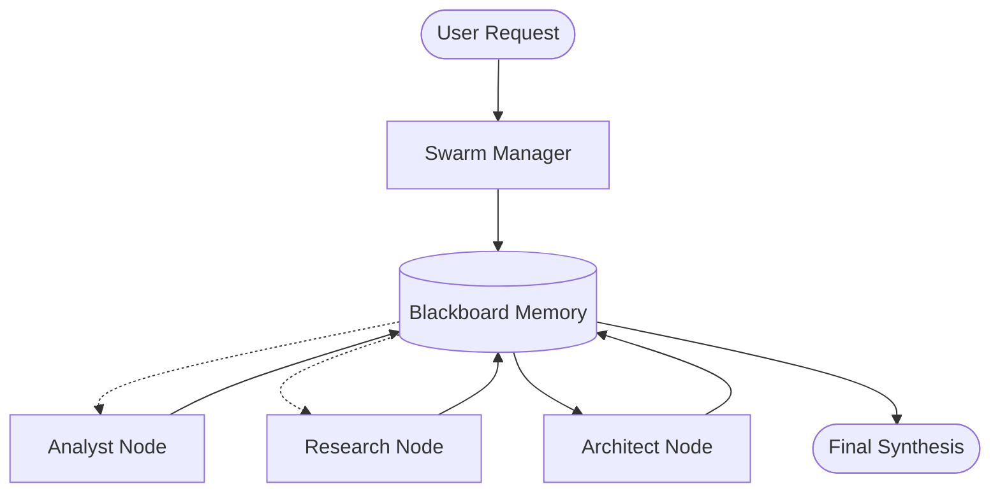

# Swarm Intelligence Architecture 🐝

This document details the multi-agent coordination system introduced in v4.0 (Phase 18).

## 1. Overview

The Swarm Intelligence system evolves the Orchestrator from a sequential pipeline to a **distributed engineering team**. It allows the system to handle multi-faceted requests by decomposing them into independent tasks that run in parallel.

## 2. Core Components

### 2.1 Swarm Manager Agent

The "Brain" of the swarm.

- **Responsibility:** Decomposes user request into a Task Directed Acyclic Graph (DAG).
- **Process:** Sets up the `Blackboard`, identifies dependencies, and monitors execution.
- **Location:** `core/agents/specialist_agents/swarm_manager.py`

### 2.2 Blackboard Memory

The "Shared Memory" for the swarm.

- **Responsibility:** Stores shared context, agent observations, and task statuses.
- **Thread Safety:** Uses asynchronous locking for atomic updates.
- **Location:** `core/memory/blackboard.py`

### 2.3 Specialist Nodes

Standard agents (Analyst, Architect, Repair) registered in the **System Cortex**.

- **Execution:** Specialists pull context from the Blackboard and push results/observations back after completion.

---

## 3. Communication Flow (The "Blackboard" Pattern)

The swarm follows the **Blackboard Architectural Pattern**:

1.  **Decomposition:** The Swarm Manager populates the Blackboard with a list of tasks.
2.  **Observation:** Specialists "watch" the Blackboard for tasks they are qualified for.
3.  **Action:** When a task's dependencies are met, the Orchestrator spawns the specialist node.
4.  **Contribution:** The specialist writes its result to the Blackboard, potentially triggering downstream tasks.



---

## 4. Parallel Execution Logic

The Orchestrator uses `asyncio` to manage the lifecycle of swarm tasks:

```python
# Conceptual loop
while tasks_remaining:
    ready_tasks = blackboard.get_tasks_with_met_dependencies()
    for task in ready_tasks:
        asyncio.create_task(run_agent_on_task(task))
    await asyncio.sleep(1)
```

## 5. Future Evolution (Phase 19+)

- **Adaptive Scaling:** Dynamically spinning up more nodes for large-scale refactors.
- **Visual DAG:** Real-time visualization of the swarm task graph in the Admin Panel.
- **Cross-Agent Review:** Implementation agents automatically launching Peer Review agents before committing.
