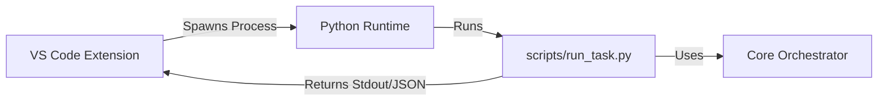

# VS Code Extension: AI Code Orchestrator Client

## Goal
Integrate the AI Code Orchestrator directly into the VS Code workflow to minimize context switching and streamline task execution.

## Features

### 1. Commands
*   `AI Orchestrator: Run Task`: Opens an input box for the user to type a request.
*   `AI Orchestrator: Add File to Context`: Adds the currently active file to the next request's context.
*   `AI Orchestrator: Clear Context`: Resets the selected context files.

### 2. Context Menu
*   **Editor Context**: Right-click on a file tab or in the editor -> `AI Orchestrator: Run Task with this Context`.
*   **Explorer Context**: Right-click on a file in the file explorer -> `AI Orchestrator: Add to Context`.

### 3. User Interface
*   **Input**: Simple Input Box for prompts.
*   **Output**:
    *   **Output Channel**: Real-time logs from the Orchestrator (Analyst -> Architect -> ...).
    *   **Webview Panel** (Optional/Phase 2): Render the final JSON result nicely (tables, code blocks).

### 4. Configuration
*   `aiOrchestrator.pythonPath`: Path to the Python interpreter (default: `python` or auto-detect venv).
*   `aiOrchestrator.projectRoot`: Path to the orchestrator root directory.

## Architecture

The extension will act as a **thin client** wrapper around the `scripts/run_task.py` script we just created.



## Implementation Plan

### Phase 1: Basic Integration (CLI Wrapper)
- [ ] Initialize extension project (`vscode-ai-orchestrator`).
- [ ] Implement `runTask` command.
- [ ] Implement Python process spawner using `child_process`.
- [ ] parse flags for `scripts/run_task.py`.
- [ ] Stream output to VS Code Output Channel.

### Phase 2: Context Management
- [ ] Create a `ContextManager` class in TypeScript to track selected files.
- [ ] Add `AddToContext` commands.
- [ ] Pass `--context` flags dynamically to the python script.

### Phase 3: UI Polish
- [ ] Add loading indicators (StatusBar item).
- [ ] structured error handling.

## Directory Structure
We will create a new folder `vscode-extension` in the project root.

```
ai-code-orchestrator/
  ├── vscode-extension/
  │   ├── package.json
  │   ├── src/
  │   │   ├── extension.ts
  │   │   └── pythonBridge.ts
  ├── scripts/
  │   └── run_task.py
```
