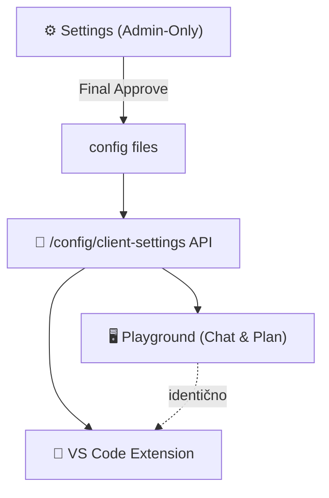

# Finalni plan — Admin Panel / Playground / Extension

## 1. Arhitektura



**Settings definiše → Config čuva → API servira → Playground i Extension prikazuju identičan set opcija.**

---

## 2. Settings (System Configuration) — Admin-Only

| Sekcija | Šta se konfigurišemo |
|---------|---------------------|
| **🔑 API Credentials** | Već podešeno — samo opcija za izmenu |
| **🤖 Agent Models** | Model/max_tokens/cascade za svakog agenta (već urađeno u [model_mapping_v2.yaml](file:///c:/Users/mgasic/Documents/AIProjects/ai-code-orchestrator/config/model_mapping_v2.yaml)) |
| **📋 User-Facing Models** | SVI modeli vidljivi, checkbox za whitelist (koji su dostupni u Playground/Extension) |
| **💰 Budget & Limits** | per_task, per_hour, per_day, monthly, strict_mode, alert_threshold |
| **⚙ Engine** | temperature, max_retries, max_tokens, max_workers |
| **📚 RAG** | Svi tiers + chunk/overlap/top_k. Korisnik može da dodaje sadržaj **samo na višim tierovima** (3+), core tiers (1-2: rules, governance) su admin-only |
| **🎛 User Options** | Koje opcije su vidljive: modes, Form Studio, Review Strategy, Consensus, Retrieval |

> [!IMPORTANT]
> **Final Approve dugme** na dnu Settings panela — sačuva u config fajlove i automatski propagira.

---

## 3. Playground = Extension (Identični)

### Korisnički modovi

| Mode | Ikona | Opis | Backend |
|------|-------|------|---------|
| **⚡ Fast** | ⚡ | Brz odgovor bez agenata, najbrži model | `mode: "question"` |
| **🧠 Thinking** | 🧠 | Dublja analiza sa RAG pretragom | `deep_search: true` |
| **🤖 Agentic** | 🤖 | Puna orkestracija: plan → architect → code → review → test | Full pipeline |

### Uvek vidljivo
- **Model dropdown** — samo whitelist sa osobinama (⚡ Fast, 🧠 High Intelligence, itd.)
- **Daily Spend** — read-only: `$0.45 / $2.00` (čita iz [CostManager](file:///c:/Users/mgasic/Documents/AIProjects/ai-code-orchestrator/core/cost_manager.py#81-535))
- **Form Studio** tab — dostupan svuda

### Advanced Options (ako admin omogući)
- Review Strategy: Basic / Strict
- Consensus Mode: On/Off
- Retrieval: Local / Hybrid

---

## 4. Kvalitet generisanog koda — Višeslojna kontrola

> [!NOTE]
> Korisnikova briga: "Agenti ne smeju da pišu šta hoće". Rešenje je **kvalitet ugrađen u proces**, ne samo naknadni review.

Orkestrator već ima **4 sloja kontrole kvaliteta**, od kojih 3 rade **BEZ dodatnih tokena**:

### Sloj 1: Pre-generisanje (0 dodatnih tokena)
- **DomainValidator** → proverava da li je zahtev u scope-u (React/TS/DynUI/.NET)
- **RAG Tier 1 (rules, governance)** → automatski se injektuje u SVAKI agent prompt
- Agenti dobijaju DynUI komponentni katalog, stilske tokene i pravila kao deo konteksta

### Sloj 2: Tokom generisanja (0 dodatnih tokena)
- **Agent system prompts** → svaki agent ima strogo definisanu ulogu i granice
- **Model Routing** → arhitekt koristi jači model (`gpt-5.2`), implementer brži (`gpt-5-mini`)
- **Cascade** → ako primarni model ne odradi kvalitetno, prelazi na sekundarni

### Sloj 3: Post-generisanje (0 dodatnih tokena)
- **OutputValidator** + **JSON Schema** → svaki output prolazi strukturnu validaciju
- **Schema fajlovi** u `phase_schemas/` definišu tačan format za svaku fazu

### Sloj 4: Opcioni Review (troši tokene — admin kontroliše)
- **Basic Review** = 1 review pass (agent pregleda generisani kod)
- **Strict Review** = detaljna analiza + sigurnost + stil
- **Consensus Mode** = 2 modela za arhitekturu, biramo bolji (2x cena)

**Zaključak**: Prvih 3 sloja garantuju kvalitet kroz RAG instrukcije i pravila. Sloj 4 je opcioni za kritične zadatke.

---

## 5. RAG tier korisničke restrikcije

| Tier | Sadržaj | Settings | Playground/Extension |
|------|---------|----------|---------------------|
| **Tier 1** | Rules, Governance, Overview | ✅ Puni pristup | ❌ Read-only (primenjuje se automatski) |
| **Tier 2** | Tokens, Styling | ✅ Puni pristup | ❌ Read-only |
| **Tier 3** | Technical, Catalog, Examples | ✅ Puni pristup | ✅ Može da dodaje i pregleda |
| **Tier 4** | Database, API, Navigation | ✅ Puni pristup | ✅ Može da dodaje i pregleda |

Svi tiers se **primenjuju** na generisani kod — korisnik samo ne može da menja core pravila (1-2).

---

## 6. Config proširenje — [limits.yaml](file:///c:/Users/mgasic/Documents/AIProjects/ai-code-orchestrator/config/limits.yaml)

```yaml
global:
  temperature: 0.0
  max_retries: 3
  per_task_budget: 0.25
  per_hour_budget: 1.0
  per_day_budget: 2.0
  strict_mode: true
  alert_threshold: 0.8

allowed_user_models:
  - gpt-5-mini
  - gpt-5.2
  - claude-sonnet-4.5

allowed_user_options:
  modes: [fast, thinking, agentic]
  form_studio: true
  show_review_strategy: false
  show_consensus_mode: false

user_rag_tiers: [3, 4]  # tiers where user can add content
```

---

## 7. Implementacione faze

### Faza 1: Config konsolidacija
- [ ] Obrisati [model_mapping.yaml](file:///c:/Users/mgasic/Documents/AIProjects/ai-code-orchestrator/config/model_mapping.yaml) (koristiti samo v2)
- [ ] Proširiti [limits.yaml](file:///c:/Users/mgasic/Documents/AIProjects/ai-code-orchestrator/config/limits.yaml): `allowed_user_models`, `allowed_user_options`, `user_rag_tiers`

### Faza 2: API endpoint `/config/client-settings`
- [ ] GET: vraća modele (whitelist + traits), modove, limite, daily spend
- [ ] `/config/daily-spend`: čita iz `CostManager._load_todays_usage()`
- [ ] POST `/config/approve`: Final Approve — piše u sve config fajlove

### Faza 3: Admin Panel Settings prerada
- [ ] Ukloniti [SettingsModal.tsx](file:///c:/Users/mgasic/Documents/AIProjects/ai-code-orchestrator/ui/src/components/SettingsModal.tsx)
- [ ] Reorganizovati tabs, dodati whitelist + user options + Final Approve
- [ ] RAG tier restrictions UI

### Faza 4: Playground sređivanje
- [ ] 3 moda (Fast/Thinking/Agentic) + model traits + daily spend
- [ ] Form Studio tab
- [ ] Ukloniti dupli budget input

### Faza 5: Extension usklađivanje
- [ ] Čita `/config/client-settings`
- [ ] Identičan UX kao Playground
- [ ] Limit spinner ograničen, Knowledge tab: samo dozvoljeni tiers
