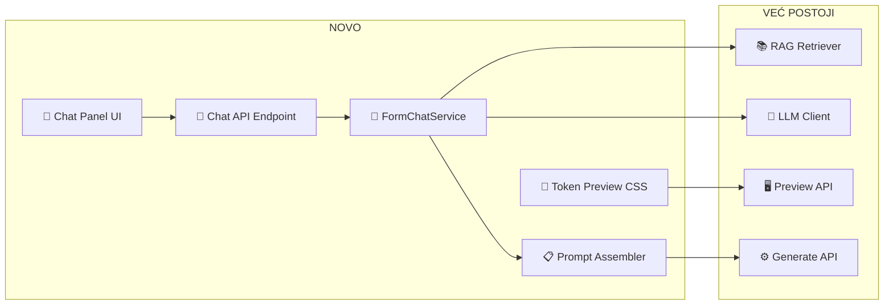

# Form Studio AI Chat + RAG — Detaljan Plan Realizacije (v2)

## Cilj

Proširiti **Form Studio tab** dodavanjem ugrađenog AI Chat panela koji je 100% fokusiran na kontekst JSON forme. Chat koristi POSTOJEĆU RAG i LLM infrastrukturu (ne pravimo ništa od nule) i na kraju sesije generiše obogaćeni prompt za orkestrator.

---

## Inventar Postojeće Infrastrukture

> [!NOTE]
> Ovo NIJE greenfield projekat. Većina infrastrukture VEĆ POSTOJI — proširujemo samo Form Studio tab.

### Orchestrator UI (Playground) — 5 stavki menija

| Stavka | Komponenta | Šta radi |
|:---|:---|:---|
| **Chat & Plan** | [OrchestratorUI.tsx](file:///c:/Users/mgasic/Documents/AIProjects/ai-code-orchestrator/ui/src/components/OrchestratorUI.tsx) | Glavni chat sa 3 moda (⚡Fast, 🧠Thinking, 🤖Agentic), model dropdown, retrieval strategy |
| **Knowledge Graph** | Placeholder | Coming Soon |
| **Manage Knowledge** | [KnowledgeTab.tsx](file:///c:/Users/mgasic/Documents/AIProjects/ai-code-orchestrator/ui/src/components/KnowledgeTab.tsx) | Upravljanje knowledge bazom |
| **Agent Registry** | [AgentRegistry.tsx](file:///c:/Users/mgasic/Documents/AIProjects/ai-code-orchestrator/ui/src/components/AgentRegistry.tsx) | Pregled agenata |
| **Form Studio** | [FormStudioTab.tsx](file:///c:/Users/mgasic/Documents/AIProjects/ai-code-orchestrator/ui/src/components/FormStudioTab.tsx) | JSON editor + preview + generate ← **OVO PROŠIRUJEMO** |

### Admin Panel — 10 tabova

| Tab | Komponenta | Relevantno za nas |
|:---|:---|:---|
| **Client Config** | `ClientSettingsPanel.tsx` | Kontroliše modele, modove, Form Studio enabled |
| **RAG Ingestion** | `IngestionPanel.tsx` | Tier-based ingestion sa validacijom ✅ |
| **Model Config** | `ModelConfigPanel.tsx` | Model routig i cascade ✅ |
| **Knowledge Base** | `KnowledgeExplorer.tsx` | Collections CRUD + semantic query ✅ |
| **Budgets & Limits** | `BudgetPanel.tsx` | Budget limiti ✅ |
| Global Settings, Dev Tools, Monitoring, Graph, API Keys | Ostali | Nisu direktno relevantni |

### Backend infrastruktura koju REUSE-ujemo

| Modul | Lokacija | Kako ga koristimo |
|:---|:---|:---|
| **LLM Client** | [llm_client_v2.py](file:///c:/Users/mgasic/Documents/AIProjects/ai-code-orchestrator/core/llm_client_v2.py) | Chat pozivi za Form Studio AI |
| **RAG Retriever** | [retriever_v2.py](file:///c:/Users/mgasic/Documents/AIProjects/ai-code-orchestrator/core/retriever_v2.py) + [domain_aware_retriever.py](file:///c:/Users/mgasic/Documents/AIProjects/ai-code-orchestrator/rag/domain_aware_retriever.py) | Tier 2-3 retrieval za form context |
| **Model Router** | [model_router_v2.py](file:///c:/Users/mgasic/Documents/AIProjects/ai-code-orchestrator/core/model_router_v2.py) | Automatski bira brzi model za chat |
| **Cost Manager** | [cost_manager.py](file:///c:/Users/mgasic/Documents/AIProjects/ai-code-orchestrator/core/cost_manager.py) | Tracking troškova chata |
| **Form Engine Orchestrator** | [orchestrator.py](file:///c:/Users/mgasic/Documents/AIProjects/ai-code-orchestrator/core/form_engine/orchestrator.py) | Generate sa enriched promptom |

---

## Šta je NOVO (scope ovog projekta)



| # | Šta se pravi | Tip |
|:---|:---|:---|
| 1 | `FormChatService` — backend servis sa RAG + LLM | **[NEW]** Python modul |
| 2 | `POST /forms/chat` + `POST /forms/chat/summarize` | **[NEW]** API rute |
| 3 | `FormChatPanel.tsx` — React komponenta za chat | **[NEW]** Frontend |
| 4 | `FormStudioTab.tsx` — dodavanje chat panela | **[MODIFY]** Frontend |
| 5 | Token-based preview CSS | **[MODIFY]** Frontend CSS |
| 6 | `enriched_instructions` u generate flow | **[MODIFY]** Backend |
| 7 | Form Engine sync iz DynUI projekta | **[SYNC]** File copy |

---

## Predložene Izmene

### 1. Backend: FormChatService + API rute

#### [NEW] [form_chat_service.py](file:///c:/Users/mgasic/Documents/AIProjects/ai-code-orchestrator/core/form_engine/form_chat_service.py)

```python
class FormChatService:
    """AI Chat 100% fokusiran na JSON form context. Reuse-uje postojeći RAG + LLM."""
    
    def __init__(self):
        self.llm = LLMClientV2()          # POSTOJEĆI
        self.retriever = DomainAwareRetriever()  # POSTOJEĆI
        self.cost_mgr = CostManager()     # POSTOJEĆI

    async def chat(self, message, current_schema, chat_history, preview_state):
        # 1. RAG retrieval (Tier 2-3: tokens + component patterns)
        rag_context = self.retriever.retrieve(message, top_k=5)
        # 2. System prompt sa schema context + RAG
        # 3. LLM call (brzi model: gpt-5-mini)
        # 4. Parse: schema mods + objašnjenje
        
    def generate_enriched_prompt(self, schema, chat_history, preview_state) -> str:
        """Sumira chat sesiju u instrukcije za orkestrator."""
        # Pokupi: layout odluke, validacije, UX preferencije, component choices
```

**System prompt ograničenja**:
- "Odgovaraj ISKLJUČIVO o JSON šemi i DynUI formi"
- "Predlozi promene kroz JSON diff format"
- "Koristi DynUI tokene, nikad hardkodirane vrednosti"

---

#### [NEW] [form_chat_routes.py](file:///c:/Users/mgasic/Documents/AIProjects/ai-code-orchestrator/api/form_chat_routes.py)

| Endpoint | Ulaz | Izlaz |
|:---|:---|:---|
| `POST /forms/chat` | `{message, schema, history[], preview_state}` | `{reply, updated_schema?, schema_diff?, rag_sources[]}` |
| `POST /forms/chat/summarize` | `{schema, history[], preview_state}` | `{enriched_prompt, summary, key_decisions[]}` |

---

#### [MODIFY] [form_routes.py](file:///c:/Users/mgasic/Documents/AIProjects/ai-code-orchestrator/api/form_routes.py) — GenerateRequest

Dodati `enriched_instructions: Optional[str] = None` u `GenerateRequest`. Prosleđuje se u `orchestrator.generate_ui_project()`.

---

#### [MODIFY] [orchestrator.py](file:///c:/Users/mgasic/Documents/AIProjects/ai-code-orchestrator/core/form_engine/orchestrator.py)

`generate_ui_project()` prima `enriched_instructions` → injektuje u `FormArchitectSpecialist` i `CodeGenerator` kontekst.

---

### 2. Frontend: Chat Panel + Proširenje FormStudio

#### [NEW] [FormChatPanel.tsx](file:///c:/Users/mgasic/Documents/AIProjects/ai-code-orchestrator/ui/src/components/FormChatPanel.tsx)

Izdvojena komponenta:
- Chat poruke (user + AI) sa markdown
- RAG source badge-ovi
- Schema diff prikaz kada AI menja JSON
- Quick actions: "Popravi validaciju", "Optimizuj layout"
- Auto-sync sa JSON editorom

---

#### [MODIFY] [FormStudioTab.tsx](file:///c:/Users/mgasic/Documents/AIProjects/ai-code-orchestrator/ui/src/components/FormStudioTab.tsx)

Restrukturiranje u **tri panela** (JSON Editor | Preview | AI Chat):

```
┌─────────────────────────────────────────────────────────┐
│  Toolbar: Layout | View Mode | Approve & Generate       │
├──────────────┬────────────────────┬─────────────────────┤
│  JSON Editor │  Token Preview     │  AI Chat            │
│  (existing)  │  (DynUI tokens)    │  (NEW)              │
│              │                    │                     │
│              │                    │  💬 "Promeni JMBG   │
│              │                    │  na third..."       │
│              │                    │  🤖 OK, ažuriram... │
│              │                    │  ⌨️ Input           │
├──────────────┴────────────────────┴─────────────────────┤
│  Logic Inspector (existing, collapsible)                 │
└─────────────────────────────────────────────────────────┘
```

**Approve & Generate** flow:
1. Klik → `POST /forms/chat/summarize` (generiše enriched prompt)
2. Prikaz sažetka ključnih odluka iz chata
3. Confirm → `POST /forms/generate` sa `enriched_instructions`

---

### 3. Token-Based Preview CSS

#### [NEW] [form-studio-preview.css](file:///c:/Users/mgasic/Documents/AIProjects/ai-code-orchestrator/ui/src/components/form-studio-preview.css)

Zamena Tailwind klasa u preview-u sa DynUI tokenima:

```css
.fs-preview-input {
  height: 42px;
  font-size: var(--dyn-font-size-sm, 0.875rem);
  border: 1px solid var(--dyn-semantic-input-border, #cbd5e1);
  border-radius: var(--dyn-border-radius-md, 0.375rem);
  padding: var(--dyn-spacing-sm) var(--dyn-spacing-md);
  background: var(--dyn-semantic-input-bg, #ffffff);
  font-family: 'Inter', sans-serif;
}

.fs-preview-label {
  font-size: var(--dyn-font-size-xs, 0.75rem);
  font-weight: 500;
  color: var(--dyn-semantic-text-secondary);
}
```

Inputi, selecti, radio u preview-u dobijaju **iste proporcije** kao DynUI komponente — ali ostaju obični HTML elementi.

---

### 4. Form Engine Sinhronizacija

#### [SYNC] DynUI form-engine → AI Code Orchestrator

```
dyn-ui-main-v01/apps/form-engine/src/  →  forms-workspace/packages/form-engine/src/
```

Fajlovi: `FormEngine.tsx`, `FieldRenderer.tsx`, `Section.tsx`, `form-engine.css`, `core/*`, `hooks/*`, `types/*`, `utils/*`

---

## Implementacione Faze

### Faza 1: Backend Chat Servis ✅
- [x] `form_chat_service.py` — reuse RAG + LLM
- [x] `form_chat_routes.py` — `/forms/chat` i `/forms/chat/summarize`
- [x] Dodati `enriched_instructions` u generate flow

### Faza 2: Frontend Chat Panel ✅
- [x] `FormChatPanel.tsx` — chat UI komponenta
- [x] Restrukturirati `FormStudioTab.tsx` — tri panela
- [x] Chat ↔ JSON editor sinhronizacija
- [x] Enriched "Approve & Generate" flow

### Faza 3: Preview Styling + Sync ✅
- [x] `form-studio-preview.css` sa DynUI tokenima
- [x] Ažurirati `PreviewFieldRenderer` na token klase
- [x] Sinhronizovati form-engine iz DynUI projekta

### Faza 4: Polish ✅
- [x] Chat streaming (SSE) — `POST /forms/chat/stream` + frontend SSE consumer sa stop dugmetom
- [x] Schema diff highlighting — `computeSchemaDiff()`, per-change vizualizacija, session-wide diff banner
- [x] Quick action dugmad — kontekstualna na osnovu broja polja, sekcija, validacija i logike u šemi

---

## Verification Plan

### Automatski Testovi
- Chat servis vraća validnu JSON šemu nakon modifikacije
- RAG retrieval vraća relevantne dokumente za form queries
- Enriched prompt sadrži sve odluke iz chat istorije
- Generate endpoint koristi enriched instructions

### Manuelna Verifikacija
1. Otvoriti Form Studio → uploadovati JSON šemu
2. Otvoriti chat → poslati "Promeni layout za JMBG na third"
3. Verifikovati da se JSON editor i preview auto-ažuriraju
4. Kliknuti "Approve & Generate" → verifikovati da generisani projekat reflektuje chat promene
5. Uporediti preview vizuelno sa pravom formom (insurance-person-entry-form) — proporcije ~95% identične
