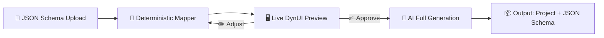
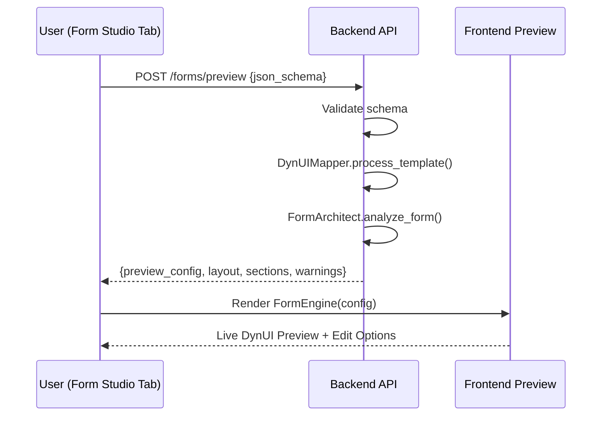

# Form Studio — Dvofazni Preview→Approve→Generate Pipeline

## Problem i Cilj

Trenutni Form Engine generiše kompletan React projekat **odmah po uploadu JSON šeme**, bez pregleda od strane korisnika. To troši AI resurse i vreme čak i kad korisnik nije zadovoljan ishodom. Cilj je napraviti **dvofazni pipeline**:

1. **Faza 1 — Instant Preview** (0 AI tokena): Deterministički rendering iz JSON šeme → živi DynUI mockup u browseru
2. **Faza 2 — Approve & Generate** (AI resursi): Tek nakon korisnikove potvrde, puna orkestracija generiše finalni projekat



---

## Postojeće Stanje (Inventar)

### Form Engine (`core/form_engine/`)
| Modul | Uloga | Status |
|-------|-------|--------|
| `generator_specialist.py` | NLP prompt → JSON template (LLM) | ✅ Aktivan |
| `specialists.py` | Layout analiza (deterministic + LLM fallback) | ✅ Aktivan |
| `mapper.py` | JSON type → DynUI component (10 mapiranja) | ⚠️ Treba proširiti na svih 44 |
| `code_generator.py` | Mapped data → TSX (standard/stepper/tabs) | ✅ Aktivan |
| `project_generator.py` | Vite scaffolding | ✅ Aktivan |
| `orchestrator.py` | Pipeline koordinator | ⚠️ Nema preview fazu |

### DynUI Library (`packages/dyn-ui-react/src/components/`)
**44 komponente**: DynAccordion, DynAppbar, DynAvatar, DynBadge, DynBox, DynBreadcrumb, DynButton, DynChart, DynCheckbox, DynContainer, DynDatePicker, DynDialog, DynDivider, DynDropdown, DynFieldContainer, DynFlex, DynGauge, DynGrid, DynIcon, DynInput, DynLabel, DynListView, DynLoading, DynMenu, DynModal, DynPage, DynPopup, DynProgress, DynRadio, DynResponsiveTabs, DynSelect, DynSidebar, DynStack, DynStepper, DynSwitch, DynTable, DynTabs, DynTextArea, DynToast, DynToolbar, DynTooltip, DynTreeView, DynUpload, ThemeSwitcher

### DynUI FormEngine (`src/form-engine/`)
**`FormEngine.tsx`** — React komponenta koja prima `FormConfig` (sections + fields) i renderuje formu sa state managementom i validacijom. **Ovo je ključ za preview** — možemo ga koristiti direktno.

---

## Predložena Arhitektura

### Faza 1: Preview (Deterministički — 0 AI tokena)

Korisnik uploaduje JSON šemu → backend je validira i mapira → frontend renderuje živi preview koristeći **prave DynUI komponente** kroz `FormEngine.tsx`.



**Šta korisnik vidi:**
- Živa forma sa pravim DynUI komponentama (DynInput, DynSelect, DynCheckbox, itd.)
- Dummy podaci u svim poljima
- Layout (standard/tabs/stepper) primenjen
- Validaciona pravila prikazana vizuelno (required polja obeležena, helper tekstovi)
- Sidebar panel sa metapodacima: broj polja, layout tip, kompleksnost, upozorenja

**Šta korisnik može:**
- Prebaciti layout (standard ↔ tabs ↔ stepper)
- Dodati/ukloniti polja iz JSON editora (side-by-side)
- Re-renderovati preview nakon svake izmene
- Approve ili Reject

### Faza 2: Generate (AI-Powered)

Tek nakon `Approve` → puna AI orkestracija generiše:
1. Kompletan React/Vite projekat sa DynUI komponentama
2. Validacioni sloj (required, min/max, pattern, email regex)
3. Output JSON schema (struktura podataka koju forma generiše)
4. Dockerfile + deployment config (opciono)

---

## JSON Schema — Proširenje za Međuzavisnosti i Validaciju

Trenutna šema podržava osnovna polja. Proširujemo je sa:

```json
{
  "metadata": {
    "title": "Employee Registration",
    "version": "2.0",
    "outputSchema": true
  },
  "form": {
    "fields": [
      {
        "id": "employmentType",
        "type": "select",
        "label": "Employment Type",
        "required": true,
        "options": ["Full-time", "Part-time", "Contract"],
        "defaultValue": "Full-time"
      },
      {
        "id": "contractEndDate",
        "type": "date",
        "label": "Contract End Date",
        "visibility": {
          "dependsOn": "employmentType",
          "condition": "equals",
          "value": "Contract"
        }
      },
      {
        "id": "salary",
        "type": "number",
        "label": "Annual Salary",
        "validation": {
          "min": 0,
          "max": 500000,
          "required": true
        }
      }
    ],
    "actions": [
      { "type": "submit", "label": "Register", "variant": "primary" }
    ]
  }
}
```

> [!IMPORTANT]
> **`visibility.dependsOn`** — omogućava polja koja se pojavljuju/nestaju na osnovu vrednosti drugog polja. Ovo se renderuje i u Preview i u finalnom projektu.

---

## Mapper Proširenje

Trenutni mapper pokriva 10 tipova. Proširujemo na **sve relevantne DynUI komponente**:

| JSON `type` | DynUI Komponenta | Napomene |
|-------------|------------------|----------|
| `text` | `DynInput` | type="text" |
| `email` | `DynInput` | type="email", email validacija |
| `password` | `DynInput` | type="password" |
| `number` | `DynInput` | type="number", min/max/step |
| `tel` | `DynInput` | type="tel" |
| `textarea` | `DynTextArea` | multiline |
| `select` | `DynSelect` | options required |
| `dropdown` | `DynDropdown` | dropdownRef za externe liste |
| `checkbox` | `DynCheckbox` | boolean toggle |
| `switch` | `DynSwitch` | alternativa za checkbox |
| `radio` | `DynRadio` | option group |
| `date` | `DynDatePicker` | kalendar UI |
| `upload` | `DynUpload` | file attachment |
| `label` | `DynLabel` | read-only tekst |
| `divider` | `DynDivider` | vizuelni separator |
| `table` | `DynTable` | tabelarni unos |

---

## Implementacione Faze

### Faza A: Backend — Preview Pipeline
- [ ] Kreirati `POST /forms/preview` endpoint u novom `api/form_routes.py`
- [ ] Proširiti `DynUIMapper` sa svim 16 mapiranja + `visibility` support
- [ ] Dodati JSON Schema validaciju (Pydantic model za input šemu)
- [ ] Generisati `FormConfig` objekat kompatibilan sa DynUI `FormEngine.tsx`
- [ ] Generisati dummy podatke za svako polje

### Faza B: Frontend — Live Preview u Form Studio Tab
- [ ] Redizajnirati `FormStudioTab.tsx`: Upload zona + Preview + JSON Editor
- [ ] Integracija sa `FormEngine` iz DynUI za live rendering
- [ ] Layout switcher (standard/tabs/stepper)
- [ ] Side-by-side: JSON editor (levo) ↔ Live preview (desno)
- [ ] Metadata panel: polja count, layout tip, upozorenja
- [ ] Approve/Reject dugmad

### Faza C: Backend — Full Generation Pipeline
- [ ] `POST /forms/generate` — AI-powered puna generacija nakon Approve
- [ ] Integrisati postojeći `FormEngineOrchestrator.generate_ui_project()`
- [ ] Generisati output JSON schema na osnovu field definicija
- [ ] Dodati `visibility` → `useEffect` conditional rendering u code generator
- [ ] Zapisivanje generisanog projekta + putanja u response

### Faza D: Frontend — Post-Generation UX
- [ ] Download link za generisani projekat (ZIP)
- [ ] Prikazati generisane fajlove u preview panelu
- [ ] StatusUpdates za tok generacije (SSE events)

### Faza E: Kvalitet i Edge Cases
- [ ] Unit testovi za mapper proširenja
- [ ] Validacija circular dependencies u visibility pravilima
- [ ] Fallback za nepoznate tipove polja

---

## Analiza Izvodljivosti

| Zahtev | Izvodljivost | Obrazloženje |
|--------|-------------|--------------|
| Live preview sa pravim DynUI komponentama | ✅ **Potpuno izvodljivo** | `FormEngine.tsx` već renderuje iz `FormConfig` objekta. Samo treba mapirati JSON → FormConfig |
| 99% tačnost generisanja | ✅ **Izvodljivo za deterministic path** | Preview faza je 100% deterministička (mapper). AI faza dodaje code quality i project scaffolding |
| Conditional field visibility | ✅ **Izvodljivo** | `dependsOn` → `useEffect` pattern, standardan React pristup |
| Output JSON schema | ✅ **Izvodljivo** | Trivijalno — čitamo field ID-ove i tipove, generišemo TypeScript interface |
| Side-by-side JSON editor + preview | ✅ **Izvodljivo** | Monaco Editor (već u dev dependencies) ili CodeMirror |
| Layout switching (standard/tabs/stepper) | ✅ **Izvodljivo** | `FormArchitectSpecialist` već ima ovu logiku, samo connect na UI toggle |
| Dummy data generation | ✅ **Izvodljivo** | Faker pattern po tipu polja (name, email, date, number...) |

> [!TIP]
> **Ključna prednost**: DynUI `FormEngine.tsx` već radi sav heavy lifting za rendering - ne moramo pisati custom render logiku. Samo transformišemo JSON šemu u `FormConfig` format i prosleđujemo.

---

## Prioritetni Redosled

1. **Faza A + B** (Preview) — Bez AI troškova, instant feedback, najveća vrednost
2. **Faza C** (Generation) — Tek nakon validiranog preview-a
3. **Faza D + E** (Polish) — UX i edge cases
