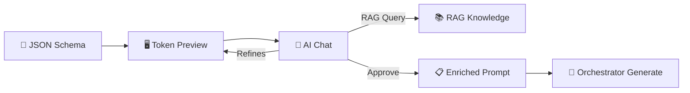
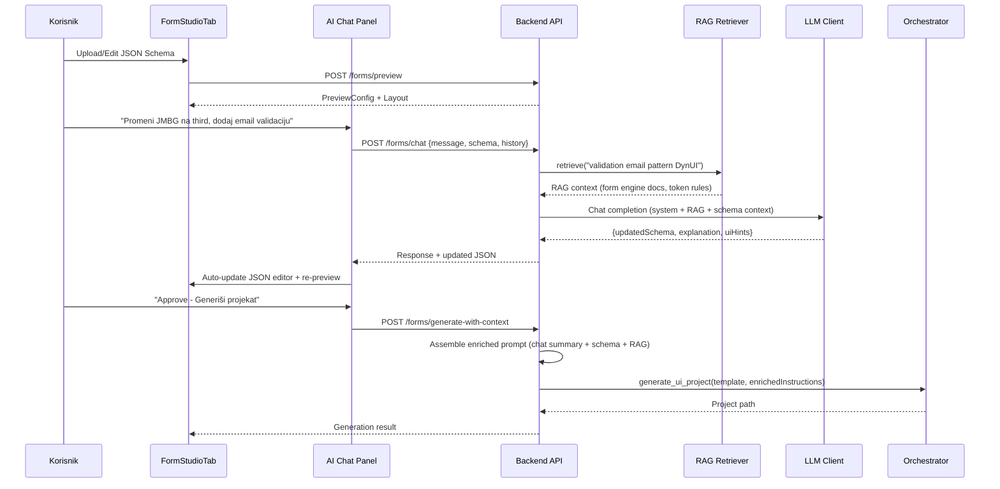

# Form Studio AI Chat + RAG — Detaljan Plan Realizacije

## Cilj

Ugraditi **AI Chat asistenta** u Form Studio tab koji:
1. Razume JSON šemu i preview formu — 100% fokusiran na kontekst forme
2. Omogućava **finetuning** preview-a kroz konverzaciju (menjanje labela, validacija, layout-a, logike)
3. Koristi **DynUI design tokene** u preview-u umesto punog DynUI komponentnog seta (vizuelno veran izgled bez ogromnog posla integracije)
4. Pristupa **RAG-u** (isti tiers kao orkestrator) — informacije koje Chat AI šalje orkestratoru su usklađene sa dokumentacijom
5. Na kraju chat sesije **generiše obogaćeni prompt** za orkestrator koji sadrži sve detalje usaglašene sa korisnikom



---

## Analiza Postojećeg Stanja

### Šta imamo ✅

| Komponenta | Lokacija | Status |
|:---|:---|:---|
| **FormStudioTab.tsx** | [ui/src/components/](file:///c:/Users/mgasic/Documents/AIProjects/ai-code-orchestrator/ui/src/components/FormStudioTab.tsx) | Funkcionalan: JSON editor + deterministic preview + Approve & Generate |
| **Preview API** | [api/form_routes.py](file:///c:/Users/mgasic/Documents/AIProjects/ai-code-orchestrator/api/form_routes.py) `POST /forms/preview` | Deterministički mapper, 0 AI tokena |
| **Generate API** | [api/form_routes.py](file:///c:/Users/mgasic/Documents/AIProjects/ai-code-orchestrator/api/form_routes.py) `POST /forms/generate` | AI generacija projekta |
| **RAG Retriever** | [core/retriever_v2.py](file:///c:/Users/mgasic/Documents/AIProjects/ai-code-orchestrator/core/retriever_v2.py) `EnhancedRAGRetriever` + [DomainAwareRetriever](file:///c:/Users/mgasic/Documents/AIProjects/ai-code-orchestrator/rag/domain_aware_retriever.py) | ChromaDB + Tier-based retrieval |
| **LLM Client** | [core/llm_client_v2.py](file:///c:/Users/mgasic/Documents/AIProjects/ai-code-orchestrator/core/llm_client_v2.py) | OpenAI/cascade model routing |
| **Form Engine RAG docs** | [docs/form_engine/ai-rag-docs/](file:///c:/Users/mgasic/Documents/AIProjects/ai-code-orchestrator/docs/form_engine/ai-rag-docs) | 5 dokumenata (Architecture, Validation, Schema Spec, Usage Patterns, Layout Standards) |
| **DynUI RAG docs** | [docs/rag-ready/](file:///c:/Users/mgasic/Documents/AIProjects/ai-code-orchestrator/docs/rag-ready) | MustFollowRules + Backend Integration |
| **Updated Form Engine** | [dyn-ui-main-v01/apps/form-engine/](file:///c:/Users/mgasic/Documents/AIProjects/dyn-ui-main-v01/apps/form-engine/src) | Modernizovan FormEngine, FieldRenderer, Section sa DynUI komponentama i tokenima |
| **Design Tokens (CSS)** | [form-engine.css](file:///c:/Users/mgasic/Documents/AIProjects/dyn-ui-main-v01/apps/form-engine/src/form-engine.css) | 12-column grid, section styling, sve preko [var(--dyn-*)](file:///c:/Users/mgasic/Documents/AIProjects/ai-code-orchestrator/core/form_engine/form_cache.py#41-54) tokena |

### Šta nedostaje ❌

| Nedostaje | Opis |
|:---|:---|
| **AI Chat UI** | Nema chat panel u Form Studio |
| **Chat API endpoint** | Nema `/forms/chat` backend ruta |
| **RAG integracija za Chat** | Chat nema pristup RAG dokumentaciji |
| **Prompt Generator** | Nema modul koji sumira chat sesiju + JSON kontekst u obogaćeni prompt |
| **Token-Based Preview CSS** | Preview koristi Tailwind klase, ne DynUI tokene |

---

## Predložena Arhitektura

### Tok podataka (Sequence Diagram)



---

## User Review Required

> [!IMPORTANT]
> **Preview strategija**: Umesto integracije punog DynUI komponentnog seta u preview (što smo se složili da je prevelik posao), plan predviđa primenu **DynUI design tokena putem CSS varijabli** na postojeće HTML elemente u preview-u. Ovo daje vizuelno veran izgled (boje, border-radius, spacing, fontovi) bez uvoza React komponenti.

> [!IMPORTANT]
> **Chat model**: Chat će koristiti brzi model (npr. `gpt-5-mini`) za responsive UX, sa RAG kontekstom iz Tier 2-3 (design tokens + technical docs). Skuplje modele koristi samo orkestrator pri generisanju.

> [!WARNING]
> **Form Engine sinhronizacija**: DynUI `apps/form-engine/` je ažuriran sa novim tokenima i komponentama. Treba kopirati ažurirane source fajlove u naš `forms-workspace/packages/form-engine/` pre nego što krenemo u implementaciju.

---

## Predložene Izmene

### Komponenta 1: Backend — Chat API + RAG

---

#### [NEW] [form_chat_service.py](file:///c:/Users/mgasic/Documents/AIProjects/ai-code-orchestrator/core/form_engine/form_chat_service.py)

**Ključni servis** — AI Chat agentspecijalizovan za JSON forme.

```python
class FormChatService:
    """AI Chat focused exclusively on JSON form schema context."""

    def __init__(self):
        self.llm = LLMClientV2()
        self.retriever = DomainAwareRetriever()

    async def chat(self, message, current_schema, chat_history, preview_state) -> ChatResponse:
        # 1. RAG retrieval (Tier 2-3: tokens, components, patterns)
        rag_context = self.retriever.retrieve(message, top_k=5)

        # 2. Build system prompt with schema context
        system_prompt = self._build_system_prompt(current_schema, preview_state, rag_context)

        # 3. LLM call (fast model)
        response = await self.llm.chat(system_prompt, chat_history + [message])

        # 4. Parse: extract schema modifications and explanation
        return self._parse_response(response)

    def generate_orchestrator_prompt(self, schema, chat_history, preview_state) -> str:
        """Summarizes all chat-refined details into enriched instructions for orchestrator."""
        # Collects: layout decisions, validation rules, UX preferences,
        #           component choices, color schemes, accessibility notes
        ...
```

**Sistem prompt** za Chat AI uključuje:
- Trenutnu JSON šemu (kompletnu)
- Preview state (layout, field count, complexity)
- RAG kontekst (tokeni, validacioni paterni, component catalog)
- Striktno ograničenje: "Odgovaraj ISKLJUČIVO u kontekstu JSON forme i DynUI komponenti"

---

#### [NEW] [form_chat_routes.py](file:///c:/Users/mgasic/Documents/AIProjects/ai-code-orchestrator/api/form_chat_routes.py)

```python
# POST /forms/chat
# Request: {message, current_schema, chat_history, preview_state}
# Response: {reply, updated_schema?, schema_diff?, ui_hints?, rag_sources[]}

# POST /forms/chat/summarize
# Request: {current_schema, chat_history, preview_state}
# Response: {enriched_prompt, summary, key_decisions[]}
```

---

#### [MODIFY] [form_routes.py](file:///c:/Users/mgasic/Documents/AIProjects/ai-code-orchestrator/api/form_routes.py)

- Dodati `enriched_instructions: Optional[str]` u [GenerateRequest](file:///c:/Users/mgasic/Documents/AIProjects/ai-code-orchestrator/api/form_routes.py#207-212) model
- `POST /forms/generate` prosleđuje `enriched_instructions` u orchestrator

---

#### [MODIFY] [orchestrator.py](file:///c:/Users/mgasic/Documents/AIProjects/ai-code-orchestrator/core/form_engine/orchestrator.py)

- [generate_ui_project()](file:///c:/Users/mgasic/Documents/AIProjects/ai-code-orchestrator/core/form_engine/orchestrator.py#54-150) prima novi parametar `enriched_instructions: str = None`
- Ako postoji, dodaje se u kontekst za [FormArchitectSpecialist](file:///c:/Users/mgasic/Documents/AIProjects/ai-code-orchestrator/core/form_engine/specialists.py#9-97) i [CodeGenerator](file:///c:/Users/mgasic/Documents/AIProjects/ai-code-orchestrator/core/form_engine/code_generator.py#6-257)
- Obogaćene instrukcije utiču na: layout odluke, validaciona pravila, stilske preferencije

---

### Komponenta 2: Frontend — AI Chat Panel + Token Preview

---

#### [MODIFY] [FormStudioTab.tsx](file:///c:/Users/mgasic/Documents/AIProjects/ai-code-orchestrator/ui/src/components/FormStudioTab.tsx)

Najveća promena na frontendu. Restrukturiranje u **tri panela**:

```
┌─────────────────────────────────────────────────┐
│  Toolbar: Layout | View | Generate              │
├──────────┬──────────────────┬───────────────────┤
│ JSON     │ Token Preview    │ AI Chat           │
│ Editor   │ (DynUI tokens)   │ (kontekstualan)   │
│          │                  │                   │
│ schema   │ [Live Form]      │ 💬 Messages       │
│ text     │                  │ 📎 Schema context │
│ area     │                  │ 🔍 RAG sources    │
│          │                  │ ⌨️ Input          │
├──────────┴──────────────────┴───────────────────┤
│  Logic Inspector (collapsible)                  │
└─────────────────────────────────────────────────┘
```

**State management**:
- `chatMessages: ChatMessage[]` — chat istorija
- `chatLoading: boolean` — streaming indikator
- `enrichedPrompt: string | null` — generisani prompt za orkestrator

**Ključne funkcionalnosti chata**:
1. Svaka poruka šalje `current_schema` + `preview_state` kao kontekst
2. Kada AI predloži promenu šeme, JSON editor se auto-ažurira
3. Diff prikaz — vizuelna oznaka šta se promenilo u šemi
4. "Approve & Generate" dugme sad poziva `/forms/chat/summarize` prvo, pa onda `/forms/generate` sa obogaćenim promptom

---

#### [NEW] [FormChatPanel.tsx](file:///c:/Users/mgasic/Documents/AIProjects/ai-code-orchestrator/ui/src/components/FormChatPanel.tsx)

Izdvojena React komponenta za chat panel:
- Prikaz poruka (user + AI) sa markdown renderingom
- RAG source indikator (koje dokumente je AI koristio)
- Auto-scroll, loading skeletal, typing indicator
- Schema diff prikaz kada AI menja JSON
- Quick actions: "Popravi validaciju", "Optimizuj layout", "Dodaj sekciju"

---

#### [MODIFY] [FormPreview](file:///c:/Users/mgasic/Documents/AIProjects/ai-code-orchestrator/ui/src/components/FormStudioTab.tsx#L236-L327) (unutar FormStudioTab.tsx)

Primeniti DynUI design tokene na preview:

```css
/* Zamena Tailwind klasa sa DynUI tokenima */
--dyn-preview-input-bg: var(--dyn-semantic-input-bg, #ffffff);
--dyn-preview-input-border: var(--dyn-semantic-input-border, #cbd5e1);
--dyn-preview-input-radius: var(--dyn-border-radius-md, 0.375rem);
--dyn-preview-input-height: 42px;
--dyn-preview-font-size: var(--dyn-font-size-sm, 0.875rem);
--dyn-preview-label-color: var(--dyn-semantic-text-secondary);
--dyn-preview-label-size: var(--dyn-font-size-xs, 0.75rem);
```

Inputi, selecti, radiobutons u preview-u dobijaju **iste vizuelne proporcije** kao prave DynUI komponente — border radius, visina, spacing, font size — ali ostaju obični HTML elementi. Tako korisnik vidi formu koja izgleda ~95% kao finalni output.

---

### Komponenta 3: Form Engine Sinhronizacija

---

#### [SYNC] Form Engine iz DynUI → AI Code Orchestrator

Kopirati ažurirane fajlove iz:
- `dyn-ui-main-v01/apps/form-engine/src/` → `forms-workspace/packages/form-engine/src/`

Fajlovi za sinhronizaciju:
- [FormEngine.tsx](file:///c:/Users/mgasic/Documents/AIProjects/dyn-ui-main-v01/apps/form-engine/src/FormEngine.tsx) — Main orchestrator component
- [FieldRenderer.tsx](file:///c:/Users/mgasic/Documents/AIProjects/dyn-ui-main-v01/apps/form-engine/src/FieldRenderer.tsx) — DynUI component mapper
- [Section.tsx](file:///c:/Users/mgasic/Documents/AIProjects/dyn-ui-main-v01/apps/form-engine/src/Section.tsx) — Section renderer sa grid support
- [form-engine.css](file:///c:/Users/mgasic/Documents/AIProjects/dyn-ui-main-v01/apps/form-engine/src/form-engine.css) — Token-based styling
- `core/` — ValidationEngine, LogicEngine, LookupService
- `hooks/` — useFormEngine, useValidation, useLookup
- `types/` — Schema types, validation types, logic types
- `utils/` — errorFormatter, formDataTransformer, schemaParser, templateMerger

---

### Komponenta 4: RAG Kontekst za Chat

---

#### Chat AI RAG Tiers

| Tier | Sadržaj | Svrha za Chat |
|:---|:---|:---|
| **Tier 1** | MustFollowRules, governance | Chat NE sme da predlaže anti-pattern rešenja |
| **Tier 2** | Design tokens, styling rules | Chat zna tačne tokene za layout, boje, spacing |
| **Tier 3** | Component catalog, usage patterns | Chat zna koje komponente postoje i kako se koriste |

**Ključna ideja**: Chat AI i orkestrator koriste **istu RAG bazu**. Tako su instrukcije koje Chat generiše u potpunosti usklađene sa onim što orkestrator očekuje i razume. Nema "lost in translation" efekat.

---

## Implementacione Faze

### Faza 1: Backend infrastruktura (Prioritet: 🔴 Kritično)
- [ ] Kreirati `form_chat_service.py` sa RAG integracijom
- [ ] Kreirati `form_chat_routes.py` (`POST /forms/chat`, `POST /forms/chat/summarize`)
- [ ] Modifikovati [form_routes.py](file:///c:/Users/mgasic/Documents/AIProjects/ai-code-orchestrator/api/form_routes.py) — dodati `enriched_instructions` u GenerateRequest
- [ ] Modifikovati [orchestrator.py](file:///c:/Users/mgasic/Documents/AIProjects/ai-code-orchestrator/core/orchestrator.py) — prosleđivanje enriched prompt-a

### Faza 2: Frontend AI Chat Panel (Prioritet: 🔴 Kritično)
- [ ] Kreirati `FormChatPanel.tsx` komponentu
- [ ] Restrukturirati [FormStudioTab.tsx](file:///c:/Users/mgasic/Documents/AIProjects/ai-code-orchestrator/ui/src/components/FormStudioTab.tsx) — tri-panel layout
- [ ] Implementirati chat ↔ JSON editor sinhronizaciju
- [ ] Implementirati "Approve" flow sa enriched promptom

### Faza 3: Token-Based Preview Styling (Prioritet: 🟡 Visok)
- [ ] Kreirati `form-studio-preview.css` sa DynUI token varijablama
- [ ] Ažurirati [PreviewFieldRenderer](file:///c:/Users/mgasic/Documents/AIProjects/ai-code-orchestrator/ui/src/components/FormStudioTab.tsx#200-233) — primeniti token klase
- [ ] Ažurirati [FormPreview](file:///c:/Users/mgasic/Documents/AIProjects/ai-code-orchestrator/ui/src/components/FormStudioTab.tsx#236-328) — 12-column grid sa token spacing-om

### Faza 4: Form Engine Sinhronizacija (Prioritet: 🟡 Visok)
- [ ] Kopirati ažurirane fajlove iz DynUI form-engine
- [ ] Verifikovati da forms-workspace koristi nove tokene
- [ ] Pokrenuti insurance-person-entry-form i potvrditi kompatibilnost

### Faza 5: Polish & Edge Cases (Prioritet: 🟢 Normalan)
- [ ] Chat streaming (SSE) za real-time odgovore
- [ ] Schema diff highlighting u editoru
- [ ] Quick action dugmad u chatu
- [ ] Error handling za RAG i LLM failove

---

## Verification Plan

### Automatski Testovi

```bash
# Backend: Test chat endpoint
cd c:\Users\mgasic\Documents\AIProjects\ai-code-orchestrator
python -m pytest tests/test_form_chat.py -v

# Backend: Test enriched prompt generation
python -m pytest tests/test_form_chat.py::test_generate_orchestrator_prompt -v
```

> Napomena: Ovi testovi se pišu u toku Faze 1. Testiramo:
> - Chat servis vraća validnu JSON šemu nakon modifikacije
> - RAG retrieval vraća relevantne dokumente za form queries
> - Enriched prompt sadrži sve key decisions iz chat istorije
> - Generate endpoint prihvata i koristi enriched instructions

### Manuelna Verifikacija (Browser)

1. **Pokrenuti backend**: `cd ai-code-orchestrator && python -m uvicorn api.main:app --reload`
2. **Pokrenuti frontend**: `cd ui && npm run dev`
3. **Otvoriti Form Studio tab** u browseru
4. **Testirati Chat**:
   - Uploadovati JSON šemu
   - Otvoriti chat panel
   - Poslati poruku: "Promeni layout za JMBG na third"
   - Verifikovati da se JSON editor automatski ažurira
   - Verifikovati da se preview re-renderuje
5. **Testirati Enriched Generate**:
   - Voditi kratku chat sesiju (2-3 poruke)
   - Kliknuti "Approve & Generate"
   - Verifikovati da generisani projekat reflektuje promene iz chata
6. **Verifikovati Token Preview**:
   - Uporediti preview vizuelno sa pravom formom (insurance-person-entry-form)
   - Border-radius, input height, font size, label pozicija treba da budu ~95% identični
