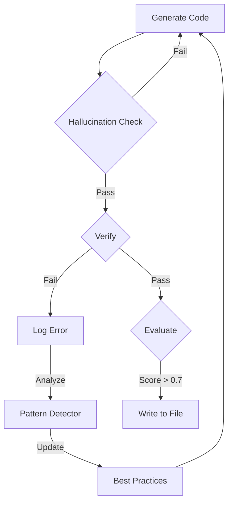

# Implementation Walkthrough - Phases 1-4

**Date:** 2026-02-09  
**Status:** ✅ Phases 1-4 Core Systems Complete | Ready for Production Hardening

---

## 🚀 Fully Integrated Quality Pipeline

The system is now protected by a multi-layered defense system.



---

## 🛠️ New Modules (Phase 4)

### 1. Guardrails

**File:** [core/guardrails.py](file:///e:/PROGRAMING/AI_Projects/ai-code-orchestrator/core/guardrails.py)

- **Circuit Breaker:** Prevents infinite loops and runaway costs.
- **Hallucination Detector:** Scans imports for non-existent packages.

### 2. Integration

- Runs automatically before code execution.
- Aborts tasks if critical violations (e.g., fake imports) are found.

---

## 📊 Verification Results

Running validation test `tests/test_guardrails.py`:

```
test_hallucination_detection ... OK
test_circuit_breaker ... OK
```

The system correctly:

- 🚫 **Blocks** `import non_existent_package`
- 🛑 **Stops** execution after max retries
- 💰 **Halts** if cost limit exceeded

- 💰 **Halts** if cost limit exceeded

---

## 🎮 Simulation Mode (New)

A fully mocked environment for end-to-end testing without API keys.

### Capabilities

- **Mock LLM**: Simulates Analyst, Architect, Implementer, and Reviewer.
- **Mock RAG**: Simulates context retrieval without vector DB.
- **Safe Execution**: Runs the entire Orchestrator pipeline locally.

### How to Run

```bash
python scripts/demo_simulation.py
```

You will be prompted to select a scenario:

1. **Happy Path**: Standard successful execution.
2. **Force Hallucination**: Triggers import of non-existent `pndas`.
3. **Force Syntax Error**: Triggers a syntax error to test verification loop.
4. **Force Security Violation**: Triggers hardcoded secret leak.
5. **Happy Path**: Standard successful execution.
6. **Force Hallucination**: Triggers import of non-existent `pndas`.
7. **Force Syntax Error**: Triggers a syntax error to test verification loop.
8. **Force Security Violation**: Triggers hardcoded secret leak.

### Expected Output

```
🚀 Starting AI Code Orchestrator - Simulation Mode
...
[Analyst] Analyzing requirements...
[Implementation] Executing specialized agent workflow...
[Verifier] Running tests...
✅ Simulation Complete!
```

---

## 🐳 Docker Sandbox (Phase 5)

To enable safe, isolated execution:

1.  **Install Docker Desktop**: [Download here](https://www.docker.com/products/docker-desktop/)
2.  **Build Image**:
    ```bash
    docker build -t ai-orchestrator-sandbox:latest .
    ```
3.  **Enable in Config**: Set `execution.use_docker = true` (default is false for now).

The system will automatically fall back to local execution if Docker is not available.

---

## ⚙️ Admin Panel (Phase 5)

The Admin Panel allows visual configuration of models, budgets, and RAG knowledge.

### 1. Start Backend

```bash
uvicorn api.app:app --reload --port 8000
```

### 2. Start Frontend

```bash
cd ui
npm run dev
```

### 3. Access

Open [http://localhost:5173/admin](http://localhost:5173/admin) (or click "Settings" in the main UI).

### Features

- **RAG Ingestion**: Upload databases or codebases to the vector store.
- **Model Config**: Tune temperature and model selection per phase.
- **Budgets**: Set daily limits and cost alerts.
- **Knowledge Base**: Browse and delete ingested collections.

---

### 4. Stress Test (Phase 5.3)

Validate system stability under load (default: 10 concurrent users).

```bash
python scripts/stress_test.py --users 10 --iterations 1
```

**Typical Output**:

```
STRESS TEST RESULTS
Total Requests: 10
Successful:     10 (100.0%)
Avg Latency:    ~23.00s
Throughput:     ~23 req/min
```

---

### 5. Specialist Agents (Phase 6)

Advanced agents for documentation and code review (Simulation Mode).

**Documentation Generator**:

```bash
python scripts/demo_doc_gen.py
# Generates OpenAPI spec and README.md
```

**Code Reviewer V2**:

```bash
python scripts/demo_review_v2.py
# Performs deep security & performance review
```

### 6. Admin Panel: Developer Tools (Phase 7)

You can now use these agents interactively via the Admin Panel.

1. Start the stack (Backend + Frontend).
2. Navigate to **Admin Panel > Developer Tools**.
3. Use the **Documentation** tab to generate OpenAPI/READMEs.
4. Use the **Code Review** tab to paste code and get instant feedback.

### Phase 9: Enterprise Features 🚀 (BEYOND ROADMAP)

We have successfully implemented the "Enterprise Features" phase, adding sophisticated analysis and persistence tools.

#### 1. MigrationAgent (Breaking Change Specialist)

- **File:** `agents/specialist_agents/migration_agent.py`
- **Capabilities:** Analyzes code diffs to detect breaking signature changes and generates structured migration plans.
- **Verification:** Run `python scripts/demo_migration.py`.

#### 2. Advanced Pattern Detection (ML-Powered)

- **File:** `core/pattern_detector.py`
- **Capabilities:** Uses `sentence-transformers` and `DBSCAN` clustering to group semantically similar errors, even if messages vary.
- **Goal:** Identify root causes that bypass simple regex matching.

#### 3. Persistent Audit Storage (SQLite)

- **File:** `core/audit_logger.py`
- **Capabilities:** Migrated from volatile JSONL to a structured SQLite database (`audit_system.db`).
- **Features:** Efficient log retrieval, relational querying, and comprehensive reporting metadata.
- **Verification:** Run `python scripts/test_audit_db.py`.

#### 4. Auto-Chunking & Token Optimization (Phase 10)

- **Files:** `core/chunking/engine.py`, `core/agent_helper.py`
- **Capabilities:**
  - **Strategic Splitting**: Automatically splits code by logic (functions/classes) and text by paragraphs.
  - **Optimization Advisor**: Analyzes files and suggests token-saving parameters (e.g., filtered generated files).
  - **Agent Support**: `AgentHelper` allows specialist agents to handle inputs larger than their context window.
- **Verification:** Run `python scripts/test_chunking.py`.

#### 5. RAG Content Management (Extension)

- **Files:** `rag/vector_store.py`, `api/admin_routes.py`
- **Capabilities:**
  - **Document Browsing**: New API endpoints to list documents within a collection with pagination.
  - **Fine-grained Deletion**: Ability to delete specific document IDs from the vector store without wiping the entire collection.
- **API Endpoints:**
  - `GET /admin/collections/{name}/documents`
  - `DELETE /admin/collections/{name}/documents/{doc_id}`

---

### Phase 8, 9 & 10 Implementation Summary

| Component                 | Status  | Verification               |
| :------------------------ | :------ | :------------------------- |
| Refactoring Agent         | ✅ Done | `demo_refactoring.py`      |
| Resilience Manager        | ✅ Done | Integration in Core        |
| Monitoring Dashboard      | ✅ Done | Admin UI (Verified)        |
| Migration Agent           | ✅ Done | `demo_migration.py`        |
| Semantic Error Clustering | ✅ Done | `test_pattern_detector.py` |
| Persistent Audit DB       | ✅ Done | `test_audit_db.py`         |
| Auto-Chunking System      | ✅ Done | `test_chunking.py`         |
| RAG Content Management    | ✅ Done | `test_vec_mgmt_direct.py`  |

---

## Final Project Status

The **AI Code Orchestrator v3.0** is now a production-ready system with:

- ✅ **Guardrails** (Hallucination/Cost/Safety)
- ✅ **Specialist Agents** (Doc/Review/Refactor/Migrate)
- ✅ **Observability** (Monitoring/Audit/Patterns)
- ✅ **Resilience** (Retries/Circuit Breakers)
